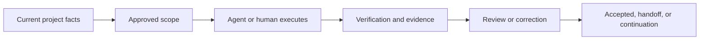

# SAGE-Kit

[English](README.md) | [中文](README.zh-CN.md)

AI can write code quickly. Keeping a long-running project coherent is harder.

SAGE-Kit keeps project-owned SPEC contracts and an embeddable Harness core that
projects can run in their own runtime.

It does not require a public command-line app. The project remains the authority
for scope, approval gates, completion criteria, and release decisions. SAGE-Kit
provides shared contracts and a portable execution model that project tools and
agents use under those rules.

SAGE-Kit is open source, stdlib-only at runtime, and its companion skill can be
used in Codex, Claude Code, OpenCode, and Kimi Work as an assistant entrypoint.

## What This Means After the CLI Removal

- Project-owned SPEC and configuration remain the source of truth. Markdown
  documents are one supported source format, not the authority model itself.
- The Harness core is embedded into and bound to the project; it does not own
  project policy.
- The project binding config is read by local tooling to resolve authority,
  active context, and admissible operations.
- Completion is decided by project SPEC/configuration and explicit approval
  gates, not by external completion signals.
- `ACTIVE_CONTEXT` is still valuable, but optional and configurable per project.
- External tools remain optional sources of execution and evidence; they are not
  authority.

## Quick Start For a Project

1. Add SAGE-Kit as a dependency where your project runtime is built.
2. Choose where the project stores project-owned SPEC sources and configure that
   mapping.
3. Initialize local project harness binding using your host runtime.
4. Route all execution decisions through project contracts, not through public
   completion indicators.

Python 3.10 or newer is required.

## SPEC Sources and Packet Model

SAGE-Kit governs SPEC semantics and execution contracts, not a required folder
structure.

Legacy projects continue to work without migration when their explicit source path
remains authorized.

The project may use one of:

- native SPEC docs under project control;
- configured legacy `docs/<M>` mapping;
- an explicit adapter source path.

Source paths are provenance. Project authority, acceptance rules, and gates remain
in project-owned SPEC and configuration.

## Optional Legacy Layout and Continuity

Projects may keep the following conventional Markdown layout for compatibility
and human-readable continuity. It is optional: configured SPEC sources and
adapters may provide the same normalized facts without recreating this tree.

- `docs/PROJECT_PROFILE.md`
- `docs/QUALITY_GATES.md`
- `docs/APPROVAL_GATES.md`
- configurable `ACTIVE_CONTEXT`
- `docs/DOC_ROUTING.md`
- `docs/MILESTONE_ROADMAP.md`
- milestone ledgers and phase documents
- milestone closeout documents

Templates continue to live under [`docs`](docs) and [`docs/templates`](docs/templates).

## Integration Architecture

The project decides whether to use:

- the local harness runtime;
- a minimal continuity checker;
- optional adapters for skills, CI, MCP tools, or reviewers.

Adapters provide execution methods and evidence, and can be configured with
approval and fallback behavior. They do not replace project-owned acceptance
logic.

## Compatibility And Legacy Behavior

SAGE-Kit preserves:

- `thin-v1` execution-document compatibility alongside `legacy-markdown`;
- `legacy-markdown` contract compatibility;
- existing `SAGE_PROJECT.json` and related legacy project baselines.

The Installed Skill is optional assistance, not project authority.

Compatibility exceptions are project-local only and do not reduce target project
gates.

## How Work Moves



A work sequence typically reads `ACTIVE_CONTEXT`, confirms scope and permissions,
performs the smallest authorized change, runs required checks, and updates
hardened project handoff state.

## How to Use the Public Skill (Optional)

The repository contains one skill at [`skills/sage-kit`](skills/sage-kit).
Install it in your runtime only if you want assistant-assisted workflow orchestration.

It is optional and does not become project authority.

## Other Skills And Tools

Coding skills, plugins, MCP tools, CI, browser automation, and reviewers are
execution inputs. They may run inside SAGE boundaries, but none may:

- expand scope;
- bypass locks, approvals, or gates;
- declare work complete by themselves.

## Repository Guide

```text
docs/                 Framework rules, templates, and optional profiles
sagekit/              Harness core and packaged resources
skills/sage-kit/      Runtime skill entrypoints and profiles
scripts/              Standalone validation helpers
tests/                Unit and compatibility tests
```

For full contract text, start with:

- [`docs/SAGE_CORE.md`](docs/SAGE_CORE.md)
- [`docs/design/EXECUTION_ECONOMY_REDESIGN.md`](docs/design/EXECUTION_ECONOMY_REDESIGN.md)

## Is It A Good Fit?

- The project spans many sessions and needs durable contracts.
- Scope, authority, or evidence mistakes are high risk.
- Multiple humans/agents need a single durable completion model.

It is likely too much for short one-off scripts, disposable prototypes, or
projects where one person can keep full state in memory.
