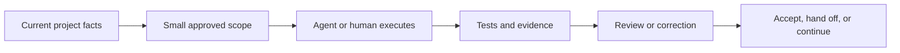

# SAGE-Kit

[English](README.md) | [中文](README.zh-CN.md)

AI can write code quickly. Keeping a long-running project coherent is harder.

SAGE-Kit gives people and AI agents shared SPEC semantics and a Harness runtime for
scope, authority, execution, evidence, and handoff across long-running projects.

SAGE-Kit is open source, stdlib-only at runtime, and its companion skill runs on
Codex, Claude Code, OpenCode, and Kimi Work / Kimi Code CLI.

## What It Helps With

- Turn a product idea into reviewable milestones and phases.
- Keep project facts outside chat history.
- Give agents clear file, authority, and approval boundaries.
- Require evidence before work is accepted.
- Resume interrupted work without pasting an entire conversation.
- Use stronger controls only when the risk justifies them.

It does not replace engineering judgment, tests, code review, or specialist
tools. It gives those activities a shared project contract.

## Quick Start

Install the CLI:

```bash
pipx install git+https://github.com/JoeKeepGo/SAGE-Kit.git@v2026.7.19.2
```

`uv` works too:

```bash
uv tool install git+https://github.com/JoeKeepGo/SAGE-Kit.git@v2026.7.19.2
```

That tag is the stable version above. Host Resource Governance, Workspace Binding,
packet schema v3, and related examples describe the current `2026.7.20.1` source
candidate; use them only from an intentional checkout of this branch or commit.

From the project you want to govern:

```bash
sagekit init --mode light --dry-run
sagekit init --mode light
sagekit doctor
sagekit check --mode light
```

Default adoption binds the installed package and creates only a small project
configuration and handoff skeleton. Framework vendoring is explicit compatibility;
`init` does not create milestones, worktrees, commits, or pushes.

To run directly from a checkout:

```bash
python -m sagekit --version
python -m sagekit check --source-repo
```

Python 3.10 or newer is required.

## SPEC Sources And Thin Execution Documents

SAGE-Kit governs SPEC semantics and execution contracts, not a mandatory documentation
directory. Milestone documents remain important; an adapter may read an explicit path,
project mapping, or legacy `docs/<M>`. The Harness consumes one location-free normalized
SPEC model; source paths are provenance, not semantic identity.

Legacy projects keep working without migration:

```bash
sagekit packet compile --target . --milestone M1
```

The same command can select an arbitrary project-authorized source:

```bash
sagekit packet compile --target . --milestone M1 --source specs/current/milestone.md
```

An explicit or configured source fails closed and never silently falls back. Compilation
writes to stdout and does not update source documents or `ACTIVE_CONTEXT`. The legacy
path remains supported and a custom path may be configured. It is a compact handoff view;
leases, candidates, counters, and full history belong under `.sagekit` or in closeouts.

Default adoption is package-bound: the project keeps its own SPEC, small
configuration, and the installed package version plus safe runtime/resource
manifest digest. It does
not copy the runtime, schemas, generic docs, Skill, templates, or tests.
Framework vendoring remains an explicit compatibility option.

`thin-v1` removes repeated generic governance prose; it does not reduce planning
depth or impose a universal maximum on Milestones, Waves, Phases, or changed
files. Accepted history remains immutable and is audited only when history scope
is explicitly requested. See the
[SPEC Source Contract](docs/agent/SPEC_SOURCE_CONTRACT.md) for the canonical
authority, scope, history, resource-admission, and review rules.

Existing `SAGE_PROJECT.json` and `legacy-markdown` contracts remain compatible;
no upgrade silently migrates their history.

Installed Skill is not project authority. The project binding and packaged,
versioned contract determine resolution even when a local Skill is missing or
older.

Packet schema v3 adds normalized SPEC identity to the v2 workspace and resolved
`conservative-host-v1` bindings. Verify with `sagekit workspace verify`, then
route local argv through `sagekit resource run`. Managed process-tree results
report `HARD` or `MANAGED`; bypass interception remains a soft cooperative
boundary; it cannot intercept a command that bypasses the runtime.

## Install The Skill

The repository ships one skill at [`skills/sage-kit`](skills/sage-kit) that
runs across agent runtimes. Copy the whole directory so `references/` ships
with it inside that runtime's Skill installation area, then restart or open a
new session so the runtime discovers it. This installs the Skill; it does not
vendor the SAGE-Kit framework into a governed project.

| Runtime | Install | Invoke explicitly |
|---|---|---|
| **Codex** | Codex skill installer | `Use $sage-kit for this task.` |
| **Claude Code** | `.claude/skills/sage-kit/` or `~/.claude/skills/sage-kit/` | `/sage-kit` |
| **OpenCode** | `.opencode/skills/sage-kit/` or `~/.config/opencode/skills/sage-kit/` | Ask for the `sage-kit` skill by name |
| **Kimi Code CLI** | The runtime's skills directory | `/skill:sage-kit` |
| **Kimi Work** | The runtime's skills directory | Ask for the `sage-kit` skill by name |

Explicit invocation is enforced natively on Codex, Claude Code, and Kimi
Code CLI. On OpenCode, set `permission.skill.sage-kit: ask` for the same
guarantee. On Kimi Work it is a soft guarantee carried by the skill
description's explicit-trigger wording.

Each runtime has an environment profile under
[`skills/sage-kit/references/`](skills/sage-kit/references) that maps
invocation, permissions, orchestration, and continuity onto that runtime:

- **Codex** is the native home; `agents/openai.yaml` holds display metadata.
- **Claude Code**
  ([`references/claude.md`](skills/sage-kit/references/claude.md)) ships
  ready-to-copy subagents and hooks under `references/claude/` that turn
  serial-file ownership and completion checks into deterministic enforcement.
- **OpenCode**
  ([`references/opencode.md`](skills/sage-kit/references/opencode.md)) ships
  a permission baseline and subagent templates.
- **Kimi Work / Kimi Code CLI**
  ([`references/kimi-runtime.md`](skills/sage-kit/references/kimi-runtime.md))
  maps the skill onto Kimi's skills index and subagent model.

The skill is an entrypoint, not a replacement for the project's own SAGE
documents. It reads the current context and routing first, then loads only
the documents needed for the task.

## Choose A Starting Mode

Start with the lightest mode that keeps the work safe.

| Mode | Good fit |
|---|---|
| **Light** | Small project, low risk, mostly serial work |
| **Standard** | Ongoing software project with multiple features and reviews |
| **Heavy** | Large or high-risk work with multiple agents, shared state, releases, migrations, or approval gates |

Heavy is not the default. Worktrees, wave execution, session orchestration,
and structured task dispatch are optional even in a Heavy project.

```bash
sagekit init --mode standard
sagekit check --mode standard
```

## How Work Moves



A typical task follows five steps:

1. Read the configured `ACTIVE_CONTEXT` and project routing; use the legacy
   `docs/ACTIVE_CONTEXT.md` path when no custom path is configured.
2. Confirm the active scope, writable files, gates, and stop conditions.
3. Make the smallest authorized change.
4. Run the verification affected by that change.
5. Update durable project state or leave a compact handoff.

Historical milestones are not loaded by default. They are read only when the
current routing points to them.

## The Files You Use Most

| File | Purpose |
|---|---|
| `PROJECT_PROFILE.md` | What the project is and what shapes its architecture |
| `QUALITY_GATES.md` | What must be proven before work is accepted |
| `APPROVAL_GATES.md` | Decisions and operations that still require a person |
| Configured `ACTIVE_CONTEXT` | Short, current project facts and handoff pointers |
| `DOC_ROUTING.md` | Which documents to read for each kind of task |
| `MILESTONE_ROADMAP.md` | Reviewable capability milestones |
| Milestone ledger | Current milestone state, evidence, decisions, and blockers |
| Phase document | Scope, file boundaries, contracts, tests, and completion evidence |
| Milestone closeout | Compact index of a completed milestone |

Templates live in [`docs/`](docs) and [`docs/templates/`](docs/templates).

## CLI At A Glance

| Command | What it does |
|---|---|
| `sagekit init --mode light` | Create a starting document set |
| `sagekit doctor` | Diagnose the current repository |
| `sagekit check` | Validate adopted project documents |
| `sagekit check --mode heavy` | Apply Heavy document requirements |
| `sagekit check --json` | Emit machine-readable findings |
| `sagekit check --source-repo` | Validate the SAGE-Kit repository itself |
| `sagekit packet compile --milestone M36 --phase P1` | Compile an ephemeral thin execution packet to stdout |
| `sagekit checkpoint status` | Check local resumable state |
| `sagekit resume` | Validate and print the next-action packet |
| `sagekit candidate freeze` | Freeze a clean or explicitly authorized working-tree candidate |

All project commands accept `--target <path>`. `check` reports `PASS`, `WARN`,
and `FAIL`; it returns a non-zero exit code when blocking findings exist.

The local continuity file lives at `.sagekit/runtime/CURRENT_RUN.json`. It is
gitignored, compact, and bound to the repository, branch, HEAD, authority, and
evidence it was created from.

### Freezing Uncommitted Work

Candidate freeze defaults to a clean worktree. When a controller is not allowed
to commit but the active packet authorizes verification of the current working
tree, bind the complete non-ignored state explicitly:

```bash
sagekit candidate freeze --snapshot-mode working-tree \
  --snapshot-authority <authority-id> \
  --contract-digest <digest> --dependency-digest <digest> \
  --review-closed --corrective-batch-closed
```

This snapshot includes staged, unstaged, untracked, deletion, mode, and symlink
state. It is not commit, submit, or acceptance authority. Any later drift makes
the candidate invalid; dirty submodules and unrepresentable paths fail closed.

## Built For Long-Running Agent Work

SAGE-Kit avoids making every task Heavy:

- **Change classes** separate status-only edits from code, contract, and
  destructive changes.
- **Evidence invalidation** reruns only checks affected by the new diff.
- **Verification lifecycle** does not count missing tools or other preflight
  failures as real test runs.
- **Review convergence** prevents a corrective review from expanding forever.
- **Continuity checkpoints** let another session resume from verified state.
- **Versioned validation** keeps closed history on its frozen contract while
  active work uses the current one.

These rules use observable workflow events. They do not depend on knowing a
user's token allowance or platform quota.

## Advanced Controls

Use these only when the project needs them:

| Need | Read |
|---|---|
| Governance and permission selection | [`GOVERNANCE_LEVELS.md`](docs/agent/GOVERNANCE_LEVELS.md) |
| Parallel lanes | [`WAVE_EXECUTION.md`](docs/agent/WAVE_EXECUTION.md) |
| PM, Coder, and Final Review sessions | [`SESSION_ORCHESTRATION.md`](docs/agent/SESSION_ORCHESTRATION.md) |
| Isolated Git workspaces | [`WORKTREE_ISOLATION.md`](docs/agent/WORKTREE_ISOLATION.md) |
| Optional tools and skills | [`CAPABILITY_ADAPTERS.md`](docs/agent/CAPABILITY_ADAPTERS.md) |
| Execution limits and evidence reuse | [`EXECUTION_ECONOMY.md`](docs/agent/EXECUTION_ECONOMY.md) |
| Host resources and workspace binding | [`HOST_RESOURCE_GOVERNANCE.md`](docs/agent/HOST_RESOURCE_GOVERNANCE.md) |
| Session resume | [`CONTINUITY_PROTOCOL.md`](docs/agent/CONTINUITY_PROTOCOL.md) |
| Legacy validation contracts | [`VALIDATION_CONTRACT_COMPATIBILITY.md`](docs/agent/VALIDATION_CONTRACT_COMPATIBILITY.md) |
| Structured task/evidence records | [`Task Dispatch Profile`](docs/profiles/task-dispatch/README.md) |

Status-only closure has a deliberately narrow `Deterministic Closure`
exception. See Session Orchestration for its receipt rules and
`VERDICT_FINALIZED_FROM_RECEIPT`; it does not replace Project Manager
acceptance.

## Other Skills And Tools

SAGE-Kit is the governance layer. Coding skills, Superpowers, plugins, MCP
tools, CI, browser automation, and reviewers remain execution tools.

They may work inside an approved SAGE boundary, but they do not get to widen
scope, bypass locks or approval gates, or declare a SAGE gate complete.
Superpowers is a useful reference integration, not a dependency.

For Codex sessions running a GPT-5.6 family model, Superpowers and
`using-superpowers` are disabled by runtime policy for controllers and every
descendant. The model still uses its native brainstorming, planning, TDD,
debugging, subagent, review, and verification capabilities.

## Repository Guide

```text
docs/                 Framework rules, templates, and optional profiles
sagekit/              Python CLI and packaged resources
skills/sage-kit/      Agent skill plus per-runtime environment profiles
scripts/              Standalone validation helpers
tests/                Unit, simulation, packaging, and compatibility tests
```

Start with [`docs/SAGE_CORE.md`](docs/SAGE_CORE.md) when you need the full
contract. For a broad or non-technical idea, use
[`PROJECT_OWNER_ENTRY.md`](docs/agent/PROJECT_OWNER_ENTRY.md) before building a
roadmap.

## Is It A Good Fit?

SAGE-Kit is useful when:

- AI agents will do a meaningful share of implementation or review.
- The project will span many sessions.
- Scope, approval, or evidence mistakes would be expensive.
- You need a durable record of what was accepted and why.

It may be too much for a short script, a disposable prototype, or a project
where one person can keep the full state in their head.

Read the kit before adopting it. Use only the parts that match your project.

## Project Status

SAGE-Kit is an alpha project. The CLI checks governance structure and evidence
records; it does not prove that a product is correct.

Licensed under the [MIT License](LICENSE).
