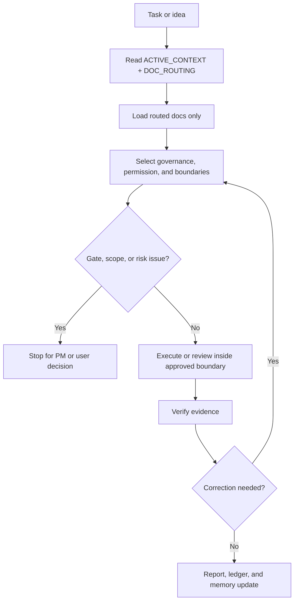

# SAGE-Kit

[English](README.md) | [中文](README.zh-CN.md)

SAGE-Kit is a reusable framework for Spec-driven Agent Governance & Execution.

It helps teams define what a project is, how it should evolve, and how AI
agents should safely perform work inside it. The kit separates durable project
specification from execution governance so that product, architecture, tests,
and agent workflows can stay aligned over many sessions.

## What SAGE-Kit Provides

- A core project specification model.
- Templates for project profiles, milestones, phases, ledgers, closeouts,
  quality gates, approval gates, and completion reports.
- Project Owner Entry for turning a non-technical idea into a lightweight
  intake, project profile draft, capability map, and candidate milestones
  before executable planning starts.
- An AI agent harness for context control, file ownership, verification,
  handoff, and review.
- Governance Levels and an Authority Matrix for choosing Light, Standard, or
  Heavy controls plus read/write/corrective permission by local scope.
- Wave Execution for safe parallel development inside a phase.
- Session Orchestration for milestone-level Project Manager, Coder, and Final
  Review controller workflows.
- Worktree Isolation for controlled phase, lane, or review workspaces when the
  Project Manager authorizes isolated execution.
- Task Dispatch Profile for structured task records, evidence records,
  resource locks, Run/Attempt/Lease tracking, and validator-backed gate
  closeout when a milestone needs stronger dispatch control.
- Capability routing so controllers can delegate to relevant external
  capabilities instead of letting governance instructions displace specialist
  execution methods.
- Capability Adapters for optional skills, plugins, MCP tools, CLIs, CI,
  reviewers, frontend tools, OpenSpec, GitNexus, and browser QA without making
  them startup or completion dependencies.
- An external capability boundary that keeps SAGE-Kit as the governance and
  evidence layer while external skills, plugins, tools, CI, and reviewers
  provide execution methods.
- Milestone planning rules that force capability maps, reviewable milestones,
  and testable phase slices before implementation.
- Strict Mode for lower-assurance or unknown model families.
- Optional profile packs for common project shapes, such as state-machine
  systems and control-plane plus execution-agent systems.
- A default model assurance policy that projects may make stricter.
- A zero-dependency local CLI prototype for read-only diagnostics and
  governance structure checks.

## Core Idea

Specification defines the project contract.

Harness defines how AI agents execute against that contract.

Project profiles adapt the shared rules to a specific architecture without
polluting the reusable core.

## Kit Contents

```text
docs/
  SAGE_CORE.md
  *_TEMPLATE.md
  agent/
    AGENT_HARNESS.md
    MODEL_ASSURANCE_POLICY.md
    STRICT_MODE.md
    GOVERNANCE_LEVELS.md
    PROJECT_OWNER_ENTRY.md
    WAVE_EXECUTION.md
    SESSION_ORCHESTRATION.md
    WORKTREE_ISOLATION.md
    MILESTONE_PLANNING.md
    CAPABILITY_ADAPTERS.md
  profiles/
    state-machine/
    control-plane-agent/
    task-dispatch/
  templates/
    PROJECT_OWNER_INTAKE_TEMPLATE.md
    CAPABILITY_MAP_TEMPLATE.md
    CAPABILITY_ADAPTER_TEMPLATE.md
    *_TEMPLATE.md
scripts/
  validate_task_dispatch.py
sagekit/
  cli.py
  check.py
  doctor.py
pyproject.toml
skills/
  sage-kit/
```

## Bundled Skill

SAGE-Kit includes `skills/sage-kit`, a Codex skill that helps agents
stay aligned with the framework during adoption, planning, implementation,
review, handoff, and milestone closeout.

The skill is intentionally a governance entrypoint, not a copy of every
SAGE-Kit document. It tells agents to read `ACTIVE_CONTEXT.md` and
`DOC_ROUTING.md` first, then load only the milestone, phase, gate, or historical
closeout files required by the task.

To use it in another environment, copy `skills/sage-kit` into the
Codex skills directory and invoke:

```text
Use $sage-kit to plan and execute this task under SAGE-Kit.
```

The skill is designed for explicit invocation so it does not displace more
specific coding, frontend, document, GitHub, review, CI, or runtime
capabilities during ordinary work.

SAGE-Kit is not a skill library. See `docs/SAGE_CORE.md#external-capability-boundary`
for the rule that external capabilities execute inside SAGE-Kit authorization,
scope, ownership, evidence, lock, and gate boundaries. Superpowers is a
reference integration when available, not a required dependency and not
something SAGE-Kit copies.

Use `docs/agent/CAPABILITY_ADAPTERS.md` when a project wants to route through
optional specialist providers such as frontend skills, OpenSpec, GitNexus,
browser QA, database tools, or CI. Adapters detect, authorize, bound, invoke,
capture, map, and fall back without silently installing tools or changing
environment configuration.

`ui-ux-pro-max`, OpenSpec, and GitNexus are approved install candidates, not
default dependencies. New environments must read current provider docs before
requesting approval and must disclose commands, write targets, rollback, and
fallback.
For `ui-ux-pro-max`, prefer a single Codex-targeted route; multi-assistant,
global, or `design-system/` writes require explicit authorization.

The skill can help bootstrap SAGE-Kit in a new project, but the project still
needs to adopt the relevant templates and maintain its own project
specification documents.

## Local CLI Runtime

SAGE-Kit includes a small Python CLI runtime. The CLI is a governance and
evidence layer, not an AI coding agent. It does not replace Superpowers,
skills, plugins, CI, reviewers, browser tools, or runtime tests; those
capabilities produce work and evidence that SAGE-Kit can route, check, or
record.

Runtime policy:

- Python `>=3.10`.
- Runtime dependencies stay stdlib-only; `pyproject.toml` keeps
  `dependencies = []`.
- Do not introduce a TypeScript or Node runtime for the CLI.
- The package version is sourced from `sagekit.__version__`; package metadata
  and `sagekit --version` read from that single value.

Install a reusable command with one of:

```bash
pipx install git+https://github.com/JoeKeepGo/SAGE-Kit.git
uv tool install git+https://github.com/JoeKeepGo/SAGE-Kit.git
python -m pip install -e .
```

Use the module entrypoint from a checkout without installation:

```bash
python -m sagekit --version
python -m sagekit doctor
python -m sagekit init --mode light --dry-run
python -m sagekit init --mode light
python -m sagekit check
python -m sagekit check --mode light
python -m sagekit check --json
```

The installed command exposes the same operations:

```bash
sagekit --version
sagekit init --mode light
sagekit check --mode light
sagekit check --mode standard
sagekit check --mode heavy
sagekit doctor
```

`sagekit init` creates SAGE-Kit governance documents for a target project. It
supports `--mode light`, `--mode standard`, and `--mode heavy`; `--dry-run`
prints planned writes without changing files; `--force` overwrites only the
selected mode's target files. It refuses to initialize inside the SAGE-Kit
source repository.

`sagekit check` is the gate-oriented validator for adopted projects. It checks
required and recommended project docs, `ACTIVE_CONTEXT.md`, `DOC_ROUTING.md`,
phase docs, completion reports, adapter evidence, and Task Dispatch records.
It exits `1` when any `FAIL` finding exists and `0` when findings are only
`PASS` or `WARN`.

`sagekit doctor` is a read-only diagnostic command. It reports whether the
target looks like the SAGE-Kit source repository or an adopted project, whether
package entrypoints exist, and whether the bundled Task Dispatch validator is
importable.

All three project commands accept `--target <path>`. Without `--target`, they
use the current working directory. With `--target`, the path is resolved as the
project root candidate; file targets are refused so `init` cannot write into an
unexpected parent directory.

Examples:

```bash
sagekit init --target ../my-project --mode light
sagekit check --target ../my-project --mode light
sagekit doctor --target ../my-project
```

Mode-aware checks are explicit:

```bash
sagekit check --mode light
sagekit check --mode standard
sagekit check --mode heavy
```

Plain `sagekit check` keeps the legacy MVP behavior: Light-level required docs
are blocking and Standard docs are advisory warnings. Explicit `--mode light`
does not warn about Standard or Heavy documents. Explicit `--mode standard`
makes Standard docs blocking. Explicit `--mode heavy` makes the minimal Heavy
controller docs blocking, but Task Dispatch, Wave Execution, Worktree
Isolation, profile activation, and adapter use remain opt-in and
artifact-triggered.

The SAGE-Kit source repository has a separate dogfood check:

```bash
sagekit check --source-repo
```

Source repo check verifies framework docs, packaged resources, template mapping,
CLI package files, tests, the console script, Python/runtime dependency policy,
and repository hygiene. It does not require instantiated project context files
such as `docs/ACTIVE_CONTEXT.md` or `docs/DOC_ROUTING.md`.

The test suite also includes simulation tests that create temporary adopted
projects and verify Light, Heavy, and failure-path governance behavior without
committing generated project runtime state.

Repository hygiene rule: the framework repository commits templates and tools,
not generated project runtime state. Do not commit `docs/ACTIVE_CONTEXT.md`,
`docs/DOC_ROUTING.md`, `docs/M[0-9]*/`, `docs/runs/`, `docs/task-records/`,
`local/`, `.sagekit/`, or `.runtime/`. Template files such as
`docs/ACTIVE_CONTEXT_TEMPLATE.md`, `docs/DOC_ROUTING_TEMPLATE.md`, and their
`sagekit/resources/` copies remain trackable.

Validator success means the governance structure is ready for review. It does
not prove product correctness, replace runtime tests, or mark milestones
accepted.

The repository still includes `sagekit.cmd` as a Windows development
convenience, but the package console script is the preferred cross-platform
entrypoint.

## Copy-Paste Prompts

Use these prompts when onboarding another Codex environment.

### 1. Install The Skill

Paste this into Codex when `sage-kit` is not installed yet:

```text
Use the skill-installer workflow to install the SAGE-Kit skill from
GitHub.

Repository: JoeKeepGo/SAGE-Kit
Path: skills/sage-kit

If the skill is already installed, do not reinstall it. If installation
succeeds, tell me to restart Codex or open a new Codex session so the new skill
is discovered.
```

Codex normally needs a restart or new session before newly installed skills are
available in the skill list.

### 2. Start A Project From Zero

After restarting Codex, paste this into the target project repository:

```text
Use $sage-kit to help me start this project from zero.

First, inspect the repository boundary and current files without making
changes. Then interview me before creating project documents.

Ask me concise questions in this order:
1. What is the product or project goal?
2. Who will use it?
3. What problem does it solve right now?
4. What should users or operators be able to do when the first usable version is successful?
5. What are the main risks, constraints, or things that must not happen?
6. Is this a small project, a standard software project, or a large/high-risk project?
7. Are AI agents expected to implement and review most of the work?
8. Are there known approval gates such as production data, credentials, paid APIs, deploys, destructive operations, or external service mutation?

After I answer, propose the lightest SAGE-Kit adoption mode that fits:
Light, Standard, or Heavy.

Then draft the minimum useful SAGE-Kit documents:
- PROJECT_PROFILE
- TECHNICAL_DESIGN when architecture is known or can be sketched
- QUALITY_GATES
- APPROVAL_GATES
- ACTIVE_CONTEXT
- DOC_ROUTING
- CAPABILITY_MAP if the idea is broad, non-technical, or roadmap granularity is uncertain
- MILESTONE_ROADMAP only after the capability map or granularity check is ready

Do not create executable milestones until the milestone granularity check
passes. Do not enable Wave Execution, Session Orchestration, Worktree Isolation,
or Task Dispatch Profile unless the project risk justifies them.
```

For an existing project that already has requirements, replace the interview
step with:

```text
Use $sage-kit to adopt SAGE-Kit for this existing repository.
Read the current README, docs, package/config files, tests, and source layout
with narrow searches first. Then propose the minimum SAGE-Kit document set and
ask before writing files.
```

## Recommended Project Layout

```text
docs/
  ACTIVE_CONTEXT.md
  DOC_ROUTING.md
  PROJECT_PROFILE.md
  TECHNICAL_DESIGN.md
  ENGINEERING_SYSTEM.md
  QUALITY_GATES.md
  APPROVAL_GATES.md
  CAPABILITY_MAP.md       # conditional for broad, non-technical, or coarse-roadmap projects
  MILESTONE_ROADMAP.md
  agent/
    AGENT_HARNESS.md
    MODEL_ASSURANCE_POLICY.md
    STRICT_MODE.md
    GOVERNANCE_LEVELS.md
    PROJECT_OWNER_ENTRY.md
    WAVE_EXECUTION.md
    SESSION_ORCHESTRATION.md
    WORKTREE_ISOLATION.md
    MILESTONE_PLANNING.md
    CAPABILITY_ADAPTERS.md
  templates/
    PROJECT_OWNER_INTAKE_TEMPLATE.md
    CAPABILITY_MAP_TEMPLATE.md
    CAPABILITY_ADAPTER_TEMPLATE.md
    PHASE_TEMPLATE.md
    MILESTONE_LEDGER_TEMPLATE.md
    MILESTONE_CLOSEOUT_TEMPLATE.md
    MILESTONE_EXECUTION_PACKET_TEMPLATE.md
    MILESTONE_RESULT_PACKET_TEMPLATE.md
    STRUCTURAL_GATE_TEMPLATE.md
    FINAL_REVIEW_PACKET_TEMPLATE.md
    CORRECTIVE_PACKET_TEMPLATE.md
    COMPLETION_REPORT_TEMPLATE.md
    LANE_PACKET_TEMPLATE.md
  M<ID>/
    00-entry-gate.md
    MILESTONE_LEDGER.md
    MILESTONE_CLOSEOUT.md  # created at milestone closure
    01-phase-name.md
    dispatch/              # optional task-dispatch profile records
      DISPATCH_BOARD.md
      TASK-001/
        task.yaml
        evidence.yaml
```

## Copy Map

Use this map when adopting SAGE-Kit into a project.

| SAGE-Kit Source | Project Destination |
|---|---|
| `docs/SAGE_CORE.md` | `docs/SAGE_CORE.md` |
| `docs/PROJECT_PROFILE_TEMPLATE.md` | `docs/PROJECT_PROFILE.md` |
| `docs/TECHNICAL_DESIGN_TEMPLATE.md` | `docs/TECHNICAL_DESIGN.md` |
| `docs/ENGINEERING_SYSTEM_TEMPLATE.md` | `docs/ENGINEERING_SYSTEM.md` |
| `docs/QUALITY_GATES_TEMPLATE.md` | `docs/QUALITY_GATES.md` |
| `docs/APPROVAL_GATES_TEMPLATE.md` | `docs/APPROVAL_GATES.md` |
| `docs/ACTIVE_CONTEXT_TEMPLATE.md` | `docs/ACTIVE_CONTEXT.md` |
| `docs/DOC_ROUTING_TEMPLATE.md` | `docs/DOC_ROUTING.md` |
| `docs/templates/PROJECT_OWNER_INTAKE_TEMPLATE.md` | Optional `docs/PROJECT_OWNER_INTAKE.md` |
| `docs/templates/CAPABILITY_MAP_TEMPLATE.md` | `docs/CAPABILITY_MAP.md` for broad, non-technical, or coarse-roadmap projects |
| `docs/agent/CAPABILITY_ADAPTERS.md` | Optional external capability adapter policy |
| `docs/templates/CAPABILITY_ADAPTER_TEMPLATE.md` | Optional provider-specific adapter record |
| `docs/templates/MILESTONE_ROADMAP_TEMPLATE.md` | `docs/MILESTONE_ROADMAP.md` |
| `docs/templates/ENTRY_GATE_TEMPLATE.md` | `docs/M<ID>/00-entry-gate.md` |
| `docs/templates/MILESTONE_LEDGER_TEMPLATE.md` | `docs/M<ID>/MILESTONE_LEDGER.md` |
| `docs/templates/MILESTONE_CLOSEOUT_TEMPLATE.md` | `docs/M<ID>/MILESTONE_CLOSEOUT.md` at milestone closure |
| `docs/templates/PHASE_TEMPLATE.md` | `docs/M<ID>/<NN>-<phase-name>.md` |
| `docs/templates/MILESTONE_EXECUTION_PACKET_TEMPLATE.md` | Milestone-level Project Manager to Coder packet |
| `docs/templates/MILESTONE_RESULT_PACKET_TEMPLATE.md` | Milestone-level Coder result packet |
| `docs/templates/STRUCTURAL_GATE_TEMPLATE.md` | Project Manager structural gate checklist |
| `docs/templates/FINAL_REVIEW_PACKET_TEMPLATE.md` | Final Review verdict packet |
| `docs/templates/CORRECTIVE_PACKET_TEMPLATE.md` | Bounded corrective work packet |
| `docs/agent/GOVERNANCE_LEVELS.md` | Light, Standard, or Heavy governance selector plus Authority Matrix |
| `docs/agent/PROJECT_OWNER_ENTRY.md` | Optional lightweight project owner entry policy |
| `docs/agent/WORKTREE_ISOLATION.md` | Optional worktree isolation policy |
| `docs/profiles/task-dispatch/` | Optional structured task dispatch profile |
| `scripts/validate_task_dispatch.py` | Optional task dispatch validator |

Copy `docs/agent/` when AI agents will execute or review work. Copy the
relevant `docs/profiles/<profile>/` templates only when the project uses that
profile.

## Adoption Flow

1. If the project starts from a broad or non-technical idea, use Project Owner
   Entry to create intake notes, a project profile draft, and a capability map.
2. Fill or refine `PROJECT_PROFILE.md`.
3. Write or adapt `TECHNICAL_DESIGN.md`.
4. Define `QUALITY_GATES.md` and `APPROVAL_GATES.md`.
5. Add `ACTIVE_CONTEXT.md` and `DOC_ROUTING.md`.
6. Create `CAPABILITY_MAP.md` for broad, non-technical, or coarse-roadmap
   projects.
7. Create draft milestone candidates from `CAPABILITY_MAP.md` when it is used.
8. Promote only candidates that pass Milestone Granularity Gate into the
   executable roadmap.
9. Create the first milestone with `00-entry-gate.md`.
10. Decompose the milestone into reviewable phases with explicit contracts,
   file boundaries, tests, and runtime checks.
11. Select the lightest safe governance level for each controller, phase, lane,
    or worker.
12. Execute each phase through retained phase docs and completion reports.
13. Use Wave Execution when safe parallel lanes can speed up the phase.
14. Use Session Orchestration for large milestones that need Project Manager,
   Coder, and Final Review controller handoff.
15. Use Worktree Isolation only when Project Manager authorizes isolated
    phase, lane, or review workspaces.
16. Use the Task Dispatch Profile only when a milestone needs structured
    task/evidence records, resource locks, lease tracking, or validator-backed
    dispatch closeout.
17. Keep milestone state in `MILESTONE_LEDGER.md`.
18. When a milestone closes, write `MILESTONE_CLOSEOUT.md` as a compact
    historical outcome index.

## Detailed Usage

### Choose An Adoption Mode

Start with the lightest mode that gives the project enough control.

| Mode | Use When | Minimum Files |
|---|---|---|
| Light adoption | Small project, low risk, one or two agents, mostly linear work. | `PROJECT_PROFILE.md`, `QUALITY_GATES.md`, `ACTIVE_CONTEXT.md`, `DOC_ROUTING.md`, one milestone ledger, one phase doc. |
| Standard adoption | Normal software project with multiple features, reviews, and recurring agent work. | Light adoption plus `TECHNICAL_DESIGN.md`, `ENGINEERING_SYSTEM.md`, `APPROVAL_GATES.md`, `MILESTONE_ROADMAP.md`, retained phase docs, completion reports. |
| Heavy adoption | Large milestone, multi-agent work, shared files, state machines, control-plane/runtime split, release risk, or high false-completion risk. | Standard adoption plus Governance Levels, Session Orchestration, optional Wave Execution, optional Worktree Isolation, and optional Task Dispatch Profile. |

Do not enable every control by default. Select the control that matches the
current risk:

- Use Governance Levels and permission modes for every non-trivial controller,
  phase, lane, or worker.
- Use Wave Execution only when writable lanes have disjoint files.
- Use Session Orchestration when a milestone is too large for repeated manual
  handoff.
- Use Worktree Isolation only when the Project Manager explicitly authorizes it.
- Use Task Dispatch Profile only when structured task/evidence records and
  validator closeout are worth the extra overhead.

### Bootstrap A New Project

For a new project, copy the core templates first:

```text
docs/SAGE_CORE.md
docs/PROJECT_PROFILE.md
docs/TECHNICAL_DESIGN.md
docs/ENGINEERING_SYSTEM.md
docs/QUALITY_GATES.md
docs/APPROVAL_GATES.md
docs/ACTIVE_CONTEXT.md
docs/DOC_ROUTING.md
docs/MILESTONE_ROADMAP.md
docs/agent/
docs/templates/
```

Then ask the agent to fill only the minimum useful draft:

```text
Use $sage-kit to bootstrap SAGE-Kit for this repository.
Start with PROJECT_PROFILE, TECHNICAL_DESIGN, QUALITY_GATES, APPROVAL_GATES,
ACTIVE_CONTEXT, DOC_ROUTING, and a draft MILESTONE_ROADMAP.
Do not create executable milestones until the capability map or roadmap
granularity check is complete.
```

The CLI can create the initial document set before the agent fills it:

```bash
sagekit init --mode light --dry-run
sagekit init --mode light
sagekit doctor
sagekit check --mode light
```

Use `--mode standard` when the project already needs technical design,
engineering system, approval gates, and a milestone roadmap. Use `--mode heavy`
only when milestone-level controller governance is justified. `init` copies the
selected mode's governance docs and core support templates, but it does not
copy optional profile packs or create executable milestone folders, task
records, worktrees, commits, or pushes.

If the project begins from a broad or non-technical idea, start even lighter:

```text
Use $sage-kit and Project Owner Entry.
Ask me for the project goal, target users, current problem, success behavior,
and main risks. Then draft PROJECT_OWNER_INTAKE, PROJECT_PROFILE, and
CAPABILITY_MAP before proposing executable milestones.
```

### Create The First Milestone

A milestone should prove one primary capability. Before implementation, create:

```text
docs/M<ID>/00-entry-gate.md
docs/M<ID>/MILESTONE_LEDGER.md
docs/M<ID>/01-<phase-name>.md
```

The entry gate should answer:

- what capability the milestone proves;
- what is explicitly out of scope;
- which phases exist and why they are reviewable;
- which governance level applies to the controller and each worker;
- which files are allowed, read-only, forbidden, or shared;
- which gates remain closed;
- which tests, runtime smoke, and review evidence are required;
- whether Wave Execution, Session Orchestration, Worktree Isolation, or Task
  Dispatch Profile is allowed.

If a milestone cannot be decomposed into clear phases with file boundaries,
contracts, tests, and smoke evidence, keep it in planning and split it further.

### Daily Agent Workflow

For ordinary implementation or review work, the agent should start narrow:

```text
Use $sage-kit for this task.
Read ACTIVE_CONTEXT and DOC_ROUTING first.
Then read only the active milestone ledger, phase doc, quality gates, approval
gates, and routed references required for this task.
Select the governance level and permission mode, name allowed files, name
forbidden files, and stop if the task needs scope expansion or a closed
approval gate.
```



A normal phase run should follow this loop:

1. Confirm the active milestone and phase.
2. Select `Light`, `Standard`, or `Heavy` and the permission mode for the
   current control scope.
3. Read the smallest safe doc set through `DOC_ROUTING.md`.
4. Inspect code or docs before assuming structure.
5. Name allowed files, read-only files, forbidden files, shared files, gates,
   tests, smoke, and stop conditions.
6. Execute only the approved phase or task.
7. Record tests, runtime smoke, skipped checks, blockers, and evidence.
8. Update the completion report and milestone ledger.
9. Update `ACTIVE_CONTEXT.md` by replacement when current-state facts changed.
10. Update `DOC_ROUTING.md` only when routing or document topology changed.

### Governance And Authority Selection

Use `docs/agent/GOVERNANCE_LEVELS.md` before dispatching substantial work.

- `Light`: narrow read-only scan, formatting/doc correction, or one small
  corrective task with no behavior, runtime, gate, security, or durable state
  change.
- `Standard`: normal phase or task that changes behavior, tests, contracts,
  runtime-visible output, or durable project docs inside one bounded ownership
  area.
- `Heavy`: milestone controller work, multiple phases, multi-agent
  orchestration, shared files, state machines, public contracts, migrations,
  releases, approval gates, production data, or high false-completion risk.

A Heavy milestone controller may still delegate Light or Standard workers.
Governance is selected per local control scope, not inherited globally.
Permission mode is selected separately: read-only review, write-authorized,
corrective-authorized, environment-write-authorized, or submit-authorized.

### Large Milestone Workflow

Use Session Orchestration when one milestone would otherwise require repeated
manual copying between Project Manager, Coder, and Final Review sessions.

The recommended control flow is:

```text
Project Manager Controller
  -> Milestone Execution Packet

Coder Controller
  -> phase workers and lane workers
  -> Milestone Result Packet

Project Manager Controller
  -> Structural Gate

Final Review Controller
  -> review workers and validation lanes
  -> Final Review Packet

Coder Controller or Corrective Worker
  -> bounded corrections when requested

Project Manager Controller
  -> accept, handoff, blocked, or next prompt
```

Coder and Final Review controllers may dispatch subagents when file ownership,
runtime ownership, evidence expectations, and stop conditions are explicit.
They may also dispatch corrective workers for bounded findings. They must stop
for Project Manager decision when correction needs new scope, approval, public
contract change, shared ownership change, or submit/cleanup authority.

### External Capabilities And Superpowers

SAGE-Kit does not replace specialist capabilities. When the runtime exposes
skills, plugins, connectors, MCP tools, CI, browser tools, review tools, or
Superpowers skills, route to them when they are relevant.

The boundary is:

- SAGE-Kit decides scope, file ownership, approval gates, evidence, locks, and
  completion status.
- External capabilities provide execution methods inside those boundaries.
- External capability output is evidence, not automatic acceptance.
- External planning output must be written into or mapped to SAGE-Kit milestone,
  phase, ledger, or packet docs.

When Superpowers is available, it is a reference integration for execution
discipline. It may help with brainstorming, writing plans, TDD, debugging,
subagent execution, review, verification, and branch finishing. If it is not
available, SAGE-Kit still runs through its own phase docs, gates, packets, and
evidence templates.

Use `docs/agent/CAPABILITY_ADAPTERS.md` for optional providers such as frontend
skills, OpenSpec, GitNexus, browser QA, database tools, or CI. Adapters default
to metadata-only or read-only. Installation, hooks, MCP config, generated
skills, or global settings require explicit approval and a fallback path.

Continuous execution is allowed only inside an approved phase, lane, task, or
corrective boundary. Stop on closed approval gates, scope expansion,
shared-file or resource-lock conflicts, failed required evidence, unapproved
runtime/destructive/submit/merge/push/cleanup operations, or any condition that
requires a higher controller decision.

### What To Record Where

Use each document for one job:

| Document | Record |
|---|---|
| `ACTIVE_CONTEXT.md` | Short current-state facts needed at startup. Replace stale facts; do not append session history. |
| `DOC_ROUTING.md` | Stable routing rules for what to read by task type. Do not record progress here. |
| `MILESTONE_LEDGER.md` | Detailed milestone progress, evidence, phase status, decisions, blockers, and current next actions. |
| Phase docs | Scope, file boundary, contract, tests, smoke, gates, and completion evidence for one phase. |
| Completion report | What changed, what was verified, skipped checks, runtime evidence, memory maintenance, and remaining gaps. |
| `MILESTONE_CLOSEOUT.md` | Compact historical outcome after the milestone is current and ready to archive. |
| Task Dispatch records | Machine-checkable task/evidence state when the Task Dispatch Profile is active. |

Workers and parallel lanes must not directly edit `ACTIVE_CONTEXT.md` or
`DOC_ROUTING.md`. They return memory update proposals; the controller applies
them serially.

### Review And Closeout

Before calling work complete:

- run required tests and runtime smoke, or state why they cannot run;
- verify file boundaries and contracts;
- verify approval gates are `PASS`, explicitly `WAIVED`, or still blocking;
- record skipped checks and gaps;
- update completion report and milestone ledger;
- update active context only with durable current-state changes;
- write milestone closeout only when the milestone is actually closing.

Final Review recommends. Project Manager decides milestone acceptance.

Historical closeouts are not default startup context. Read them only through
`DOC_ROUTING.md` when a task needs prior milestone outcomes, decisions, gaps, or
provenance.

## Applicability

SAGE-Kit is not a fit for every project. Review the kit before adopting it to
confirm that its planning depth, documentation structure, and AI agent workflow
match the project you want to run.

## Non-Goals

- SAGE-Kit is not a project management application.
- SAGE-Kit is not a replacement for tests, reviews, or runtime verification.
- SAGE-Kit does not prescribe one programming language, framework, hosting
  model, database, or agent provider.
