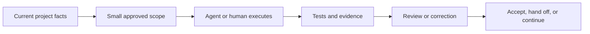

# SAGE-Kit

[English](README.md) | [中文](README.zh-CN.md)

AI can write code quickly. Keeping a long-running project coherent is harder.

SAGE-Kit gives people and AI agents a shared record of scope, decisions,
evidence, and what happens next. It is designed for projects where work spans
many sessions and "the agent said it was done" is not enough.

SAGE-Kit is open source, written in Python, and has no runtime dependencies.

## What It Helps With

- Turn a product idea into reviewable milestones and phases.
- Keep project facts outside chat history.
- Give agents clear file, authority, and approval boundaries.
- Require evidence before work is accepted.
- Resume interrupted work without pasting an entire conversation.
- Use stronger controls only when the risk justifies them.

It does not replace engineering judgment, tests, code review, or specialist
tools. It gives those activities a shared project contract.

## Quick Start

Install the CLI:

```bash
pipx install git+https://github.com/JoeKeepGo/SAGE-Kit.git
```

`uv` works too:

```bash
uv tool install git+https://github.com/JoeKeepGo/SAGE-Kit.git
```

From the project you want to govern:

```bash
sagekit init --mode light --dry-run
sagekit init --mode light
sagekit doctor
sagekit check --mode light
```

`init` creates the starting documents. It does not create milestones,
worktrees, commits, or pushes.

To run directly from a checkout:

```bash
python -m sagekit --version
python -m sagekit check --source-repo
```

Python 3.10 or newer is required.

## Add The Skill

The repository includes a Codex skill at
[`skills/sage-kit`](skills/sage-kit). Install it with Codex's skill installer,
then open a new session so Codex discovers it.

Start a task with:

```text
Use $sage-kit for this task.
```

The skill is an entrypoint, not a replacement for the project's own SAGE
documents. It reads the current context and routing first, then loads only the
documents needed for the task.

## Choose A Starting Mode

Start with the lightest mode that keeps the work safe.

| Mode | Good fit |
|---|---|
| **Light** | Small project, low risk, mostly serial work |
| **Standard** | Ongoing software project with multiple features and reviews |
| **Heavy** | Large or high-risk work with multiple agents, shared state, releases, migrations, or approval gates |

Heavy is not the default. Worktrees, wave execution, session orchestration,
and structured task dispatch are optional even in a Heavy project.

```bash
sagekit init --mode standard
sagekit check --mode standard
```

## How Work Moves



A typical task follows five steps:

1. Read `ACTIVE_CONTEXT.md` and `DOC_ROUTING.md`.
2. Confirm the active scope, writable files, gates, and stop conditions.
3. Make the smallest authorized change.
4. Run the verification affected by that change.
5. Update durable project state or leave a compact handoff.

Historical milestones are not loaded by default. They are read only when the
current routing points to them.

## The Files You Use Most

| File | Purpose |
|---|---|
| `PROJECT_PROFILE.md` | What the project is and what shapes its architecture |
| `QUALITY_GATES.md` | What must be proven before work is accepted |
| `APPROVAL_GATES.md` | Decisions and operations that still require a person |
| `ACTIVE_CONTEXT.md` | Short, current project facts |
| `DOC_ROUTING.md` | Which documents to read for each kind of task |
| `MILESTONE_ROADMAP.md` | Reviewable capability milestones |
| Milestone ledger | Current milestone state, evidence, decisions, and blockers |
| Phase document | Scope, file boundaries, contracts, tests, and completion evidence |
| Milestone closeout | Compact index of a completed milestone |

Templates live in [`docs/`](docs) and [`docs/templates/`](docs/templates).

## CLI At A Glance

| Command | What it does |
|---|---|
| `sagekit init --mode light` | Create a starting document set |
| `sagekit doctor` | Diagnose the current repository |
| `sagekit check` | Validate adopted project documents |
| `sagekit check --mode heavy` | Apply Heavy document requirements |
| `sagekit check --json` | Emit machine-readable findings |
| `sagekit check --source-repo` | Validate the SAGE-Kit repository itself |
| `sagekit checkpoint status` | Check local resumable state |
| `sagekit resume` | Validate and print the next-action packet |
| `sagekit candidate freeze` | Freeze a stable verification candidate |

All project commands accept `--target <path>`. `check` reports `PASS`, `WARN`,
and `FAIL`; it returns a non-zero exit code when blocking findings exist.

The local continuity file lives at `.sagekit/runtime/CURRENT_RUN.json`. It is
gitignored, compact, and bound to the repository, branch, HEAD, authority, and
evidence it was created from.

## Built For Long-Running Agent Work

SAGE-Kit avoids making every task Heavy:

- **Change classes** separate status-only edits from code, contract, and
  destructive changes.
- **Evidence invalidation** reruns only checks affected by the new diff.
- **Verification lifecycle** does not count missing tools or other preflight
  failures as real test runs.
- **Review convergence** prevents a corrective review from expanding forever.
- **Continuity checkpoints** let another session resume from verified state.
- **Versioned validation** keeps closed history on its frozen contract while
  active work uses the current one.

These rules use observable workflow events. They do not depend on knowing a
user's token allowance or platform quota.

## Advanced Controls

Use these only when the project needs them:

| Need | Read |
|---|---|
| Governance and permission selection | [`GOVERNANCE_LEVELS.md`](docs/agent/GOVERNANCE_LEVELS.md) |
| Parallel lanes | [`WAVE_EXECUTION.md`](docs/agent/WAVE_EXECUTION.md) |
| PM, Coder, and Final Review sessions | [`SESSION_ORCHESTRATION.md`](docs/agent/SESSION_ORCHESTRATION.md) |
| Isolated Git workspaces | [`WORKTREE_ISOLATION.md`](docs/agent/WORKTREE_ISOLATION.md) |
| Optional tools and skills | [`CAPABILITY_ADAPTERS.md`](docs/agent/CAPABILITY_ADAPTERS.md) |
| Execution limits and evidence reuse | [`EXECUTION_ECONOMY.md`](docs/agent/EXECUTION_ECONOMY.md) |
| Session resume | [`CONTINUITY_PROTOCOL.md`](docs/agent/CONTINUITY_PROTOCOL.md) |
| Legacy validation contracts | [`VALIDATION_CONTRACT_COMPATIBILITY.md`](docs/agent/VALIDATION_CONTRACT_COMPATIBILITY.md) |
| Structured task/evidence records | [`Task Dispatch Profile`](docs/profiles/task-dispatch/README.md) |

Status-only closure has a deliberately narrow `Deterministic Closure`
exception. See Session Orchestration for its receipt rules and
`VERDICT_FINALIZED_FROM_RECEIPT`; it does not replace Project Manager
acceptance.

## Other Skills And Tools

SAGE-Kit is the governance layer. Coding skills, Superpowers, plugins, MCP
tools, CI, browser automation, and reviewers remain execution tools.

They may work inside an approved SAGE boundary, but they do not get to widen
scope, bypass locks or approval gates, or declare a SAGE gate complete.
Superpowers is a useful reference integration, not a dependency.

## Repository Guide

```text
docs/                 Framework rules, templates, and optional profiles
sagekit/              Python CLI and packaged resources
skills/sage-kit/      Codex skill
scripts/              Standalone validation helpers
tests/                Unit, simulation, packaging, and compatibility tests
```

Start with [`docs/SAGE_CORE.md`](docs/SAGE_CORE.md) when you need the full
contract. For a broad or non-technical idea, use
[`PROJECT_OWNER_ENTRY.md`](docs/agent/PROJECT_OWNER_ENTRY.md) before building a
roadmap.

## Is It A Good Fit?

SAGE-Kit is useful when:

- AI agents will do a meaningful share of implementation or review.
- The project will span many sessions.
- Scope, approval, or evidence mistakes would be expensive.
- You need a durable record of what was accepted and why.

It may be too much for a short script, a disposable prototype, or a project
where one person can keep the full state in their head.

Read the kit before adopting it. Use only the parts that match your project.

## Project Status

SAGE-Kit is an alpha project. The CLI checks governance structure and evidence
records; it does not prove that a product is correct.

Licensed under the [MIT License](LICENSE).
