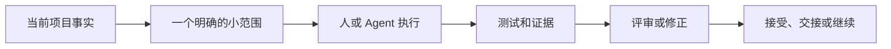

# SAGE-Kit

[English](README.md) | [中文](README.zh-CN.md)

AI 写代码很快，难的是让一个长期项目始终保持清晰。

SAGE-Kit 用一套共享记录管理范围、决策、验证证据和下一步，让人和 Agent
不必靠聊天记录维持项目状态。它适合跨越多个 Session 的项目，也适合那些
不能只凭一句“已经完成”就接受结果的工作。

SAGE-Kit 开源、使用 Python 编写，运行时没有第三方依赖。配套的 Agent
Skill 可在 Codex、Claude Code、OpenCode 和 Kimi Work / Kimi Code CLI
中使用。

## 它解决什么问题

- 把产品想法整理成可以评审的 Milestone 和 Phase。
- 把项目事实留在仓库里，而不是留在聊天记录里。
- 明确 Agent 能改什么、谁有权批准、什么操作必须停下来。
- 要求用测试和证据证明结果。
- 中断后继续工作，不必复制整段对话。
- 只在风险需要时使用更重的治理。

它不替代工程判断、测试、代码评审或专业工具。它的作用是让这些工作遵循
同一份项目合同。

## 快速开始

安装 CLI：

```bash
pipx install git+https://github.com/JoeKeepGo/SAGE-Kit.git@v2026.7.19.1
```

也可以使用 `uv`：

```bash
uv tool install git+https://github.com/JoeKeepGo/SAGE-Kit.git@v2026.7.19.1
```

进入需要采用 SAGE-Kit 的项目：

```bash
sagekit init --mode light --dry-run
sagekit init --mode light
sagekit doctor
sagekit check --mode light
```

`init` 只创建起步文档，不会自动创建 Milestone、worktree、commit 或 push。

在源码仓库中也可以直接运行：

```bash
python -m sagekit --version
python -m sagekit check --source-repo
```

需要 Python 3.10 或更高版本。

## 安装 Skill

仓库在 [`skills/sage-kit`](skills/sage-kit) 提供同一个 Skill，可在多个
Agent 运行时中使用。安装时请复制整个目录（包含 `references/`），然后
重启或新开 Session，让运行时重新发现它。

| 运行时 | 安装位置 | 显式调用 |
|---|---|---|
| **Codex** | Codex skill installer | `Use $sage-kit for this task.` |
| **Claude Code** | `.claude/skills/sage-kit/` 或 `~/.claude/skills/sage-kit/` | `/sage-kit` |
| **OpenCode** | `.opencode/skills/sage-kit/` 或 `~/.config/opencode/skills/sage-kit/` | 按名称请求 `sage-kit` Skill |
| **Kimi Code CLI** | 运行时的 skills 目录 | `/skill:sage-kit` |
| **Kimi Work** | 运行时的 skills 目录 | 按名称请求 `sage-kit` Skill |

显式调用在 Codex、Claude Code 和 Kimi Code CLI 上有原生强制；在
OpenCode 上需要配置 `permission.skill.sage-kit: ask` 才能达到同等保证；
在 Kimi Work 上则是由 Skill 描述中的显式触发措辞提供的软保证。

每个运行时的环境档案位于
[`skills/sage-kit/references/`](skills/sage-kit/references)，分别描述
调用方式、权限、编排和续接在该运行时中的映射：

- **Codex** 是原生环境；`agents/openai.yaml` 存放展示元数据。
- **Claude Code**
  （[`references/claude.md`](skills/sage-kit/references/claude.md)）
  在 `references/claude/` 附带可直接复制的子代理和 Hook，把串行文件
  归属和完成检查变成确定性执行。
- **OpenCode**
  （[`references/opencode.md`](skills/sage-kit/references/opencode.md)）
  附带权限基线和子代理模板。
- **Kimi Work / Kimi Code CLI**
  （[`references/kimi-runtime.md`](skills/sage-kit/references/kimi-runtime.md)）
  把 Skill 映射到 Kimi 的 skills 索引和子代理模型。

Skill 是入口，不替代项目自己的 SAGE 文档。它会先读取当前状态和文档路由，
然后只加载这次任务真正需要的内容。

## 选择起步模式

从足够安全的最轻模式开始。

| 模式 | 适合的项目 |
|---|---|
| **Light** | 小项目、低风险、工作基本串行 |
| **Standard** | 持续开发的软件项目，有多个功能和评审 |
| **Heavy** | 多 Agent、共享状态、发布、迁移或审批风险较高的大型工作 |

Heavy 不是默认选项。即使采用 Heavy，worktree、并行 Wave、Session
Orchestration 和结构化 Task Dispatch 仍然是按需启用的能力。

```bash
sagekit init --mode standard
sagekit check --mode standard
```

## 一次工作如何推进



一项普通任务通常只有五步：

1. 读取 `ACTIVE_CONTEXT.md` 和 `DOC_ROUTING.md`。
2. 确认范围、可写文件、Gate 和停止条件。
3. 完成最小的已授权修改。
4. 只运行受这次修改影响的验证。
5. 更新项目事实，或留下紧凑的 Handoff。

历史 Milestone 默认不会进入上下文。只有当前路由明确指向它们时才读取。

## 最常用的文件

| 文件 | 记录什么 |
|---|---|
| `PROJECT_PROFILE.md` | 项目是什么，以及架构由什么决定 |
| `QUALITY_GATES.md` | 接受工作前必须证明什么 |
| `APPROVAL_GATES.md` | 哪些决定和操作仍然需要人批准 |
| `ACTIVE_CONTEXT.md` | 简短、最新的项目事实 |
| `DOC_ROUTING.md` | 不同任务应该读取哪些文档 |
| `MILESTONE_ROADMAP.md` | 可以独立评审的能力 Milestone |
| Milestone ledger | 当前状态、证据、决策和阻塞 |
| Phase 文档 | 范围、文件边界、合同、测试和完成证据 |
| Milestone closeout | 已完成 Milestone 的紧凑结果索引 |

模板位于 [`docs/`](docs) 和 [`docs/templates/`](docs/templates)。

## CLI 常用命令

| 命令 | 作用 |
|---|---|
| `sagekit init --mode light` | 创建起步文档 |
| `sagekit doctor` | 诊断当前仓库 |
| `sagekit check` | 检查已经采用 SAGE-Kit 的项目 |
| `sagekit check --mode heavy` | 使用 Heavy 文档要求 |
| `sagekit check --json` | 输出机器可读结果 |
| `sagekit check --source-repo` | 检查 SAGE-Kit 源码仓库 |
| `sagekit checkpoint status` | 检查本地续接状态 |
| `sagekit resume` | 验证并输出下一步任务包 |
| `sagekit candidate freeze` | 冻结一个稳定验证候选 |

所有项目命令都支持 `--target <path>`。`check` 输出 `PASS`、`WARN` 和
`FAIL`；存在阻塞问题时返回非零退出码。

本地续接文件位于 `.sagekit/runtime/CURRENT_RUN.json`。它默认不进入 Git，
内容紧凑，并绑定创建时的仓库、分支、HEAD、Authority 和 Evidence。

## 为长期 Agent 开发设计

SAGE-Kit 不会把每项工作都变成 Heavy：

- **Change Class** 区分状态文字、代码、合同和破坏性修改。
- **Evidence Invalidation** 只重跑受新 Diff 影响的检查。
- **Verification Lifecycle** 不会把缺少工具等 Preflight 问题计为真实测试。
- **Review Convergence** 防止修正评审无限扩大范围。
- **Continuity Checkpoint** 让新 Session 从可信状态继续。
- **Versioned Validation** 让关闭历史沿用冻结合同，当前工作使用新合同。

这些规则只依赖可以观察的工作事件，不需要知道用户的 Token 额度或平台余量。

## 高级能力

只在项目确实需要时使用：

| 需要解决的问题 | 阅读 |
|---|---|
| 治理档位和权限选择 | [`GOVERNANCE_LEVELS.md`](docs/agent/GOVERNANCE_LEVELS.md) |
| 安全的并行 Lane | [`WAVE_EXECUTION.md`](docs/agent/WAVE_EXECUTION.md) |
| PM、Coder 和 Final Review Session | [`SESSION_ORCHESTRATION.md`](docs/agent/SESSION_ORCHESTRATION.md) |
| 隔离 Git 工作区 | [`WORKTREE_ISOLATION.md`](docs/agent/WORKTREE_ISOLATION.md) |
| 可选工具和 Skills | [`CAPABILITY_ADAPTERS.md`](docs/agent/CAPABILITY_ADAPTERS.md) |
| 执行限制和证据复用 | [`EXECUTION_ECONOMY.md`](docs/agent/EXECUTION_ECONOMY.md) |
| Session 续接 | [`CONTINUITY_PROTOCOL.md`](docs/agent/CONTINUITY_PROTOCOL.md) |
| 历史验证合同 | [`VALIDATION_CONTRACT_COMPATIBILITY.md`](docs/agent/VALIDATION_CONTRACT_COMPATIBILITY.md) |
| 结构化 Task/Evidence | [`Task Dispatch Profile`](docs/profiles/task-dispatch/README.md) |

纯状态收尾有一个范围很窄的 `Deterministic Closure` 例外。它的 Receipt
规则和 `VERDICT_FINALIZED_FROM_RECEIPT` 定义在 Session Orchestration 中，
不能替代 Project Manager 的正式 Acceptance。

## 和其他 Skills、工具的关系

SAGE-Kit 是治理层。编码 Skills、Superpowers、插件、MCP 工具、CI、浏览器自动化
和 Reviewer 仍然负责具体执行。

它们可以在批准的 SAGE 边界内工作，但不能擅自扩大范围、绕过资源锁和审批 Gate，
也不能替 SAGE-Kit 宣告 Gate 完成。Superpowers 是很适合搭配的参考能力，但不是依赖。

## 仓库结构

```text
docs/                 规范、模板和可选 Profile
sagekit/              Python CLI 和打包资源
skills/sage-kit/      Agent Skill 和各运行时环境档案
scripts/              独立验证工具
tests/                单元、模拟、打包和兼容性测试
```

需要了解完整合同，可以从 [`docs/SAGE_CORE.md`](docs/SAGE_CORE.md) 开始。
如果项目还只是一个宽泛或非工程化的想法，先使用
[`PROJECT_OWNER_ENTRY.md`](docs/agent/PROJECT_OWNER_ENTRY.md)，再创建 Roadmap。

## 适不适合你的项目

以下情况比较适合：

- AI Agent 会承担相当一部分实现或评审工作。
- 项目会跨越很多 Session。
- 范围、审批或证据错误的代价比较高。
- 需要长期保留“做了什么、为什么接受”的记录。

如果只是短脚本、一次性原型，或者一个人可以轻松记住全部状态，SAGE-Kit
可能反而太重。

采用前请先阅读内容，只使用与你的项目匹配的部分。

## 项目状态

SAGE-Kit 目前处于 Alpha 阶段。CLI 可以检查治理结构和 Evidence Records，
但不能证明产品本身一定正确。

项目使用 [MIT License](LICENSE)。
