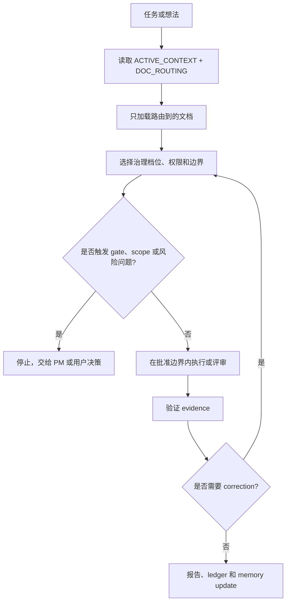

# SAGE-Kit

[English](README.md) | [中文](README.zh-CN.md)

SAGE-Kit 是一套面向 Spec-driven Agent Governance & Execution 的可复用框架。

它帮助团队定义项目是什么、应该如何演进，以及 AI Agent 应该如何在项目中安全地执行开发、评审、交接和收尾工作。SAGE-Kit 将长期稳定的项目规范和执行治理分离，让产品目标、架构边界、测试证据和 Agent 工作流可以在多轮会话中保持一致。

## SAGE-Kit 提供什么

- 核心项目规范模型。
- 项目 profile、milestone、phase、ledger、closeout、quality gate、approval gate、completion report 模板。
- Project Owner Entry，用于把非工程化的想法转换成轻量 intake、project profile draft、capability map 和候选 milestones。
- 用于上下文控制、文件所有权、验证、交接和评审的 AI Agent Harness。
- Governance Levels 和 Authority Matrix，用于按局部范围选择
  Light、Standard 或 Heavy 控制，并声明 read/write/corrective 权限。
- Phase 内安全并行开发的 Wave Execution。
- Milestone 级 Project Manager、Coder、Final Review 控制器工作流的 Session Orchestration。
- Project Manager 授权下的 Worktree Isolation，用于受控的 phase、lane 或 review 独立工作区。
- Task Dispatch Profile，用于在复杂 milestone 中维护结构化 task record、evidence record、资源锁、Run/Attempt/Lease 和 validator gate closeout。
- Capability Routing，让控制器把任务路由给合适的外部 capability，而不是让治理文档挤掉专业执行方法。
- Capability Adapters，用于把 frontend skills、OpenSpec、GitNexus、browser
  QA、数据库工具、CI、reviewer 等外部能力接入为可选 provider，而不是启动或完成依赖。
- External Capability Boundary，用来明确 SAGE-Kit 是 governance 和
  evidence 层；外部 skill、plugin、tool、CI 和 reviewer 只在边界内提供执行方法。
- 强制先做 capability map，并拆细 milestone 与 phase 的规划规则，让工作可评审、可测试、边界明确。
- 针对低保障或未知模型族的 Strict Mode。
- 可选的项目形态 profile，例如状态机系统、控制后台加执行 agent 系统。
- 项目可自行收紧的默认模型保障策略。
- 零依赖本地 CLI 原型，用于只读诊断和治理结构检查。

## 核心思想

Specification 定义项目契约。

Harness 定义 AI Agent 如何在这个契约内执行。

Project profile 用来把通用规则适配到具体架构，避免污染可复用核心。

## Kit 内容

```text
docs/
  SAGE_CORE.md
  *_TEMPLATE.md
  agent/
    AGENT_HARNESS.md
    MODEL_ASSURANCE_POLICY.md
    STRICT_MODE.md
    GOVERNANCE_LEVELS.md
    PROJECT_OWNER_ENTRY.md
    WAVE_EXECUTION.md
    SESSION_ORCHESTRATION.md
    WORKTREE_ISOLATION.md
    MILESTONE_PLANNING.md
    CAPABILITY_ADAPTERS.md
  profiles/
    state-machine/
    control-plane-agent/
    task-dispatch/
  templates/
    PROJECT_OWNER_INTAKE_TEMPLATE.md
    CAPABILITY_MAP_TEMPLATE.md
    CAPABILITY_ADAPTER_TEMPLATE.md
    *_TEMPLATE.md
scripts/
  validate_task_dispatch.py
sagekit/
  cli.py
  check.py
  doctor.py
pyproject.toml
skills/
  sage-kit/
```

## 内置 Skill

SAGE-Kit 包含 `skills/sage-kit`，这是一个 Codex skill，用来帮助 Agent 在采用、规划、实现、评审、交接和 milestone closeout 时保持 SAGE-Kit 对齐。

这个 skill 是治理入口，不是所有 SAGE-Kit 文档的复制品。它要求 Agent 先读取 `ACTIVE_CONTEXT.md` 和 `DOC_ROUTING.md`，再根据任务只加载必要的 milestone、phase、gate、packet 或历史 closeout 文件。

在其他环境中使用时，可以将 `skills/sage-kit` 复制到 Codex skills 目录，然后显式调用：

```text
Use $sage-kit to plan and execute this task under SAGE-Kit.
```

这个 skill 设计为显式调用，避免在普通开发中挤掉更具体的 coding、frontend、document、GitHub、review、CI 或 runtime capabilities。

SAGE-Kit 不是 skill library。参见 `docs/SAGE_CORE.md#external-capability-boundary`：外部 capability 只能在 SAGE-Kit 的 authorization、scope、ownership、evidence、lock 和 gate 边界内执行。Superpowers 是可用时的参考集成，不是必需依赖，也不是 SAGE-Kit 要复制的内容。

当项目要接入 frontend skills、OpenSpec、GitNexus、browser QA、数据库工具或 CI
这类可选专业能力时，使用 `docs/agent/CAPABILITY_ADAPTERS.md`。Adapter 负责
detect、authorize、bound、invoke、capture、map 和 fallback；不会静默安装工具或改写环境配置。

`ui-ux-pro-max`、OpenSpec 和 GitNexus 是批准后可安装的候选 adapter，不是默认依赖。
新环境必须先读取当前 provider 文档，再申请批准，并说明命令、写入目标、回滚方式和 fallback。
对于 `ui-ux-pro-max`，优先使用单一 Codex 目标路径；multi-assistant、global 或
`design-system/` 写入都需要显式授权。

Skill 可以帮助新项目引入 SAGE-Kit，但项目仍然需要采用相关模板并维护自己的项目规范文档。

## 本地 CLI Runtime

SAGE-Kit 包含一个小型 Python CLI runtime。这个 CLI 是 governance 和 evidence
层，不是 AI coding agent。它不替代 Superpowers、skills、plugins、CI、reviewer、
browser tools 或 runtime tests；这些外部能力负责执行工作并产出证据，SAGE-Kit
负责路由、检查或记录。

Runtime policy：

- Python `>=3.10`。
- 运行时保持 stdlib-only；`pyproject.toml` 保持 `dependencies = []`。
- 不为 CLI 引入 TypeScript 或 Node runtime。
- 版本号以 `sagekit.__version__` 为单一来源；package metadata 和
  `sagekit --version` 都读取这个值。

可以用以下任一方式安装可复用命令：

```bash
pipx install git+https://github.com/JoeKeepGo/SAGE-Kit.git
uv tool install git+https://github.com/JoeKeepGo/SAGE-Kit.git
python -m pip install -e .
```

从源码 checkout 中也可以不安装，直接使用 Python module 入口：

```bash
python -m sagekit --version
python -m sagekit doctor
python -m sagekit init --mode light --dry-run
python -m sagekit init --mode light
python -m sagekit check
python -m sagekit check --mode light
python -m sagekit check --json
```

安装后的命令提供同样能力：

```bash
sagekit --version
sagekit init --mode light
sagekit check --mode light
sagekit check --mode standard
sagekit check --mode heavy
sagekit doctor
```

`sagekit init` 用来为目标项目创建 SAGE-Kit 治理文档。它支持
`--mode light`、`--mode standard` 和 `--mode heavy`；`--dry-run` 只打印计划写入，
不修改文件；`--force` 只覆盖当前 mode 选择的目标文件。它会拒绝在 SAGE-Kit
源仓库中实例化项目运行态文档。

`sagekit check` 是面向 gate 的 adopted project validator。它会检查
required/recommended docs、`ACTIVE_CONTEXT.md`、`DOC_ROUTING.md`、phase docs、
completion reports、adapter evidence 和 Task Dispatch records。只要存在 `FAIL`
finding 就退出 `1`；只有 `PASS` 或 `WARN` 时退出 `0`。

`sagekit doctor` 是只读诊断命令，用来判断目标路径更像 SAGE-Kit 源仓库还是已采用
SAGE-Kit 的项目，并检查 package entrypoint 和内置 Task Dispatch validator 是否可用。

`init`、`check` 和 `doctor` 都支持 `--target <path>`。不传 `--target` 时仍使用
current working directory。传入 `--target` 时，该路径会被解析为项目根候选；如果
target 是普通文件会被拒绝，避免 `init` 意外写入父目录。

示例：

```bash
sagekit init --target ../my-project --mode light
sagekit check --target ../my-project --mode light
sagekit doctor --target ../my-project
```

Mode-aware check 需要显式启用：

```bash
sagekit check --mode light
sagekit check --mode standard
sagekit check --mode heavy
```

普通 `sagekit check` 保留 MVP 兼容行为：Light 级 required docs 是阻塞项，
Standard docs 是 advisory warnings。显式 `--mode light` 不会提示 Standard 或
Heavy 文档。显式 `--mode standard` 会让 Standard docs 成为阻塞项。显式
`--mode heavy` 会让最小 Heavy controller docs 成为阻塞项，但 Task Dispatch、
Wave Execution、Worktree Isolation、profile activation 和 adapter use 仍然是按需启用、
由 artifacts 触发，不会因为 Heavy mode 自动强制开启。

SAGE-Kit 源仓库使用单独的 dogfood check：

```bash
sagekit check --source-repo
```

Source repo check 会检查 framework docs、packaged resources、template mapping、
CLI package files、tests、console script、Python/runtime dependency policy 和 repo
hygiene。它不会要求源仓库存在已实例化项目才需要的 `docs/ACTIVE_CONTEXT.md` 或
`docs/DOC_ROUTING.md`。

测试套件还包含模拟测试，会在临时目录中创建 adopted project，验证 Light、Heavy
和 failure-path 治理行为，同时不会把生成态项目运行文件提交进源仓库。

Repo hygiene 规则：框架仓库提交 templates 和 tools，不提交生成态项目上下文。不要提交
`docs/ACTIVE_CONTEXT.md`、`docs/DOC_ROUTING.md`、`docs/M[0-9]*/`、`docs/runs/`、
`docs/task-records/`、`local/`、`.sagekit/` 或 `.runtime/`。模板文件，例如
`docs/ACTIVE_CONTEXT_TEMPLATE.md`、`docs/DOC_ROUTING_TEMPLATE.md` 以及它们在
`sagekit/resources/` 中的副本，仍然应该可被追踪。

Validator 通过只代表治理结构已具备被评审的条件。它不证明产品正确性，不替代 runtime
tests，也不能替 Project Manager 或项目负责人接受 milestone。

仓库中仍保留 `sagekit.cmd` 作为 Windows 开发便利入口，但 package console script
才是推荐的三平台统一入口。

## 可复制 Prompt

把 SAGE-Kit 带到另一个 Codex 环境时，可以直接使用下面的 prompts。

### 1. 安装 Skill

当 `sage-kit` 还没有安装时，把这段发给 Codex：

```text
Use the skill-installer workflow to install the SAGE-Kit skill from
GitHub.

Repository: JoeKeepGo/SAGE-Kit
Path: skills/sage-kit

If the skill is already installed, do not reinstall it. If installation
succeeds, tell me to restart Codex or open a new Codex session so the new skill
is discovered.
```

Codex 通常需要重启或新开会话后，才能在 skill 列表中发现新安装的 skill。

### 2. 从 0 开始构建项目

重启 Codex 后，在目标项目仓库中粘贴：

```text
Use $sage-kit to help me start this project from zero.

First, inspect the repository boundary and current files without making
changes. Then interview me before creating project documents.

Ask me concise questions in this order:
1. What is the product or project goal?
2. Who will use it?
3. What problem does it solve right now?
4. What should users or operators be able to do when the first usable version is successful?
5. What are the main risks, constraints, or things that must not happen?
6. Is this a small project, a standard software project, or a large/high-risk project?
7. Are AI agents expected to implement and review most of the work?
8. Are there known approval gates such as production data, credentials, paid APIs, deploys, destructive operations, or external service mutation?

After I answer, propose the lightest SAGE-Kit adoption mode that fits:
Light, Standard, or Heavy.

Then draft the minimum useful SAGE-Kit documents:
- PROJECT_PROFILE
- QUALITY_GATES
- ACTIVE_CONTEXT
- DOC_ROUTING
- TECHNICAL_DESIGN when architecture is known, can be sketched, or Standard/Heavy adoption is selected
- ENGINEERING_SYSTEM when recurring human/AI workflow needs governance or Standard/Heavy adoption is selected
- APPROVAL_GATES when approval-sensitive actions exist or Standard/Heavy adoption is selected
- CAPABILITY_MAP if the idea is broad, non-technical, or roadmap granularity is uncertain
- MILESTONE_ROADMAP only after the capability map or granularity check is ready

Do not create executable milestones until the milestone granularity check
passes. Do not enable Wave Execution, Session Orchestration, Worktree Isolation,
or Task Dispatch Profile unless the project risk justifies them.
```

如果是已有项目，可以把访谈部分替换成：

```text
Use $sage-kit to adopt SAGE-Kit for this existing repository.
Read the current README, docs, package/config files, tests, and source layout
with narrow searches first. Then propose the minimum SAGE-Kit document set and
ask before writing files.
```

## 推荐项目结构

```text
docs/
  ACTIVE_CONTEXT.md
  DOC_ROUTING.md
  PROJECT_PROFILE.md
  TECHNICAL_DESIGN.md
  ENGINEERING_SYSTEM.md
  QUALITY_GATES.md
  APPROVAL_GATES.md
  CAPABILITY_MAP.md       # 宽泛、非工程化启动或 roadmap 颗粒度偏粗时使用
  MILESTONE_ROADMAP.md
  agent/
    AGENT_HARNESS.md
    MODEL_ASSURANCE_POLICY.md
    STRICT_MODE.md
    GOVERNANCE_LEVELS.md
    PROJECT_OWNER_ENTRY.md
    WAVE_EXECUTION.md
    SESSION_ORCHESTRATION.md
    WORKTREE_ISOLATION.md
    MILESTONE_PLANNING.md
    CAPABILITY_ADAPTERS.md
  templates/
    PROJECT_OWNER_INTAKE_TEMPLATE.md
    CAPABILITY_MAP_TEMPLATE.md
    CAPABILITY_ADAPTER_TEMPLATE.md
    PHASE_TEMPLATE.md
    MILESTONE_LEDGER_TEMPLATE.md
    MILESTONE_CLOSEOUT_TEMPLATE.md
    MILESTONE_EXECUTION_PACKET_TEMPLATE.md
    MILESTONE_RESULT_PACKET_TEMPLATE.md
    STRUCTURAL_GATE_TEMPLATE.md
    FINAL_REVIEW_PACKET_TEMPLATE.md
    CORRECTIVE_PACKET_TEMPLATE.md
    COMPLETION_REPORT_TEMPLATE.md
    LANE_PACKET_TEMPLATE.md
  M<ID>/
    00-entry-gate.md
    MILESTONE_LEDGER.md
    MILESTONE_CLOSEOUT.md  # milestone 关闭时创建
    01-phase-name.md
    dispatch/              # 可选 task-dispatch profile records
      DISPATCH_BOARD.md
      TASK-001/
        task.yaml
        evidence.yaml
```

## 复制映射

采用 SAGE-Kit 时可以参考：

| SAGE-Kit Source | Project Destination |
|---|---|
| `docs/SAGE_CORE.md` | `docs/SAGE_CORE.md` |
| `docs/PROJECT_PROFILE_TEMPLATE.md` | `docs/PROJECT_PROFILE.md` |
| `docs/TECHNICAL_DESIGN_TEMPLATE.md` | `docs/TECHNICAL_DESIGN.md` |
| `docs/ENGINEERING_SYSTEM_TEMPLATE.md` | `docs/ENGINEERING_SYSTEM.md` |
| `docs/QUALITY_GATES_TEMPLATE.md` | `docs/QUALITY_GATES.md` |
| `docs/APPROVAL_GATES_TEMPLATE.md` | `docs/APPROVAL_GATES.md` |
| `docs/ACTIVE_CONTEXT_TEMPLATE.md` | `docs/ACTIVE_CONTEXT.md` |
| `docs/DOC_ROUTING_TEMPLATE.md` | `docs/DOC_ROUTING.md` |
| `docs/templates/PROJECT_OWNER_INTAKE_TEMPLATE.md` | 可选 `docs/PROJECT_OWNER_INTAKE.md` |
| `docs/templates/CAPABILITY_MAP_TEMPLATE.md` | 面向宽泛、非工程化启动或 roadmap 颗粒度偏粗项目的 `docs/CAPABILITY_MAP.md` |
| `docs/agent/CAPABILITY_ADAPTERS.md` | 可选外部能力 adapter policy |
| `docs/templates/CAPABILITY_ADAPTER_TEMPLATE.md` | 可选 provider-specific adapter record |
| `docs/templates/MILESTONE_ROADMAP_TEMPLATE.md` | `docs/MILESTONE_ROADMAP.md` |
| `docs/templates/ENTRY_GATE_TEMPLATE.md` | `docs/M<ID>/00-entry-gate.md` |
| `docs/templates/MILESTONE_LEDGER_TEMPLATE.md` | `docs/M<ID>/MILESTONE_LEDGER.md` |
| `docs/templates/MILESTONE_CLOSEOUT_TEMPLATE.md` | `docs/M<ID>/MILESTONE_CLOSEOUT.md` |
| `docs/templates/PHASE_TEMPLATE.md` | `docs/M<ID>/<NN>-<phase-name>.md` |
| `docs/templates/MILESTONE_EXECUTION_PACKET_TEMPLATE.md` | Milestone 级 Project Manager 到 Coder packet |
| `docs/templates/MILESTONE_RESULT_PACKET_TEMPLATE.md` | Milestone 级 Coder result packet |
| `docs/templates/STRUCTURAL_GATE_TEMPLATE.md` | Project Manager structural gate checklist |
| `docs/templates/FINAL_REVIEW_PACKET_TEMPLATE.md` | Final Review verdict packet |
| `docs/templates/CORRECTIVE_PACKET_TEMPLATE.md` | Bounded corrective work packet |
| `docs/agent/GOVERNANCE_LEVELS.md` | Light、Standard、Heavy 治理档位选择器和 Authority Matrix |
| `docs/agent/PROJECT_OWNER_ENTRY.md` | 可选轻量 Project Owner 入口策略 |
| `docs/agent/WORKTREE_ISOLATION.md` | 可选 worktree isolation policy |
| `docs/profiles/task-dispatch/` | 可选结构化任务调度 profile |
| `scripts/validate_task_dispatch.py` | 可选 task dispatch validator |

当 AI Agent 会执行或评审工作时，复制 `docs/agent/`。仅当项目使用对应形态时，才复制相关 `docs/profiles/<profile>/` 模板。

## 采用流程

1. 如果项目从宽泛或非工程化想法开始，先用 Project Owner Entry 生成 intake、project profile draft 和 capability map。
2. 填写或完善 `PROJECT_PROFILE.md`。
3. 定义 `QUALITY_GATES.md`。
4. 添加 `ACTIVE_CONTEXT.md` 和 `DOC_ROUTING.md`。
5. 当选择 Standard/Heavy adoption，或风险要求时，编写或适配
   `TECHNICAL_DESIGN.md`、`ENGINEERING_SYSTEM.md` 和 `APPROVAL_GATES.md`。
6. 对宽泛、非工程化启动或 roadmap 颗粒度偏粗的项目创建 `CAPABILITY_MAP.md`。
7. 当使用 `CAPABILITY_MAP.md` 时，从中生成候选 milestones。
8. 只有通过 Milestone Granularity Gate 的候选 milestone 才能进入可执行 roadmap。
9. 用 `00-entry-gate.md` 创建第一个 milestone。
10. 将 milestone 拆成边界明确、可评审、可测试的 phases。
11. 为每个 controller、phase、lane 或 worker 选择足够安全的最轻治理档位。
12. 通过保留的 phase docs 和 completion reports 执行每个 phase。
13. 当 Phase 内存在安全并行 lane 时使用 Wave Execution。
14. 当大型 milestone 需要 Project Manager、Coder、Final Review 控制器交接时使用 Session Orchestration。
15. 只有 Project Manager 授权时，才使用 Worktree Isolation 创建独立 phase、lane 或 review 工作区。
16. 只有当 milestone 需要结构化 task/evidence records、资源锁、lease tracking 或 validator closeout 时，才启用 Task Dispatch Profile。
17. 在 `MILESTONE_LEDGER.md` 中维护 milestone 状态。
18. Milestone 关闭时，写入 `MILESTONE_CLOSEOUT.md` 作为紧凑的历史结果索引。

## 详细使用方法

### 选择采用模式

先从足够安全的最轻模式开始。

| 模式 | 适用场景 | 最少文件 |
|---|---|---|
| Light adoption | 小项目、低风险、一两个 agent、基本串行工作。 | `PROJECT_PROFILE.md`、`QUALITY_GATES.md`、`ACTIVE_CONTEXT.md`、`DOC_ROUTING.md`、一个 milestone ledger、一个 phase doc。 |
| Standard adoption | 普通软件项目，有多个功能、评审和长期 agent 工作。 | Light adoption 加上 `TECHNICAL_DESIGN.md`、`ENGINEERING_SYSTEM.md`、`APPROVAL_GATES.md`、`MILESTONE_ROADMAP.md`、保留的 phase docs、completion reports。 |
| Heavy adoption | 大型 milestone、多 agent、共享文件、状态机、控制层加运行层、发布风险或高 false-completion 风险。 | Standard adoption 加上 Governance Levels、Session Orchestration、可选 Wave Execution、可选 Worktree Isolation、可选 Task Dispatch Profile。 |

不要默认启用所有控制。按当前风险选择：

- 非平凡 controller、phase、lane 或 worker 都先选择 Governance Level 和
  Permission Mode。
- 只有 writable lanes 文件互不重叠时才使用 Wave Execution。
- Milestone 太大、人工来回复制交接成本太高时使用 Session Orchestration。
- 只有 Project Manager 明确授权时才使用 Worktree Isolation。
- 只有结构化 task/evidence records 和 validator closeout 的收益大于成本时才使用 Task Dispatch Profile。
- 当工作仅限规划包、ledger、evidence/status、review packet、closeout
  或 submit handoff、人工交接是主要成本、submit 或 push 已明确授权或单独交给
  Submit Controller，并且不改变产品代码或 gate authority 时，使用
  Planning Package Closeout，让一个 root session 编排 Planning Author、
  Planning Review、Targeted Fix、closure verification（严格 Deterministic
  Closure 或 Targeted Re-Review）、Closeout/Status 和 Submit Controller，但保持角色权限分离。

### 初始化新项目

新项目先复制当前 adoption mode 选择的模板。Light 从 baseline 文件开始：

```text
docs/SAGE_CORE.md
docs/PROJECT_PROFILE.md
docs/QUALITY_GATES.md
docs/ACTIVE_CONTEXT.md
docs/DOC_ROUTING.md
docs/agent/
docs/templates/
```

当选择 Standard/Heavy adoption，或项目风险需要这些控制时，再添加
`TECHNICAL_DESIGN.md`、`ENGINEERING_SYSTEM.md`、`APPROVAL_GATES.md` 和
`MILESTONE_ROADMAP.md`。

然后让 agent 只填写最小有用草稿：

```text
Use $sage-kit to bootstrap SAGE-Kit for this repository.
Start with the Light baseline: PROJECT_PROFILE, QUALITY_GATES,
ACTIVE_CONTEXT, and DOC_ROUTING. Add TECHNICAL_DESIGN, ENGINEERING_SYSTEM,
APPROVAL_GATES, and a draft MILESTONE_ROADMAP only when Standard or Heavy
adoption is selected or the project risk requires them.
Do not create executable milestones until the capability map or roadmap
granularity check is complete.
```

也可以先用 CLI 创建初始文档集，再让 agent 填写：

```bash
sagekit init --mode light --dry-run
sagekit init --mode light
sagekit doctor
sagekit check --mode light
```

当项目已经需要 technical design、engineering system、approval gates 和 milestone
roadmap 时，使用 `--mode standard`。只有 milestone-level controller governance
确实有必要时才使用 `--mode heavy`。`init` 只复制当前 mode 选择的治理文档和核心支持模板，
不会自动复制可选 profile packs，也不会创建 executable milestone folders、task records、
worktrees、commits 或 pushes。

如果项目从宽泛或非工程化想法开始，可以更轻：

```text
Use $sage-kit and Project Owner Entry.
Ask me for the project goal, target users, current problem, success behavior,
and main risks. Then draft PROJECT_OWNER_INTAKE, PROJECT_PROFILE, and
CAPABILITY_MAP before proposing executable milestones.
```

### 创建第一个 Milestone

一个 milestone 应该证明一个主要 capability。实现前先创建：

```text
docs/M<ID>/00-entry-gate.md
docs/M<ID>/MILESTONE_LEDGER.md
docs/M<ID>/01-<phase-name>.md
```

Entry gate 需要回答：

- 这个 milestone 证明哪个 capability；
- 哪些内容明确不做；
- 有哪些 phases，以及为什么每个 phase 都可评审；
- controller 和每个 worker 使用哪个 governance level；
- 哪些文件 allowed、read-only、forbidden 或 shared；
- 哪些 gates 保持关闭；
- 需要哪些 tests、runtime smoke 和 review evidence；
- 是否允许 Wave Execution、Session Orchestration、Worktree Isolation 或 Task Dispatch Profile。

如果一个 milestone 不能拆成有清晰文件边界、contract、tests 和 smoke evidence 的 phases，就先留在 planning，继续拆小。

### 日常 Agent 工作流

普通实现或评审任务，agent 应该从窄上下文开始：

```text
Use $sage-kit for this task.
Read ACTIVE_CONTEXT and DOC_ROUTING first.
Then read only the active milestone ledger, phase doc, quality gates, approval
gates, and routed references required for this task.
Select the governance level and permission mode, name allowed files, name
forbidden files, and stop if the task needs scope expansion or a closed
approval gate.
```



一个普通 phase 应该按这个循环执行：

1. 确认 active milestone 和 phase。
2. 为当前 control scope 选择 `Light`、`Standard` 或 `Heavy`，并选择
   Permission Mode。
3. 通过 `DOC_ROUTING.md` 读取最小安全文档集。
4. 先检查代码或文档，再假设结构。
5. 写明 allowed files、read-only files、forbidden files、shared files、gates、tests、smoke 和 stop conditions。
6. 只执行已批准的 phase 或 task。
7. 记录 tests、runtime smoke、skipped checks、blockers 和 evidence。
8. 更新 completion report 和 milestone ledger。
9. 只有当前状态事实改变，且 permission mode 与 ownership 都允许直接写入时，才用替换方式更新 `ACTIVE_CONTEXT.md`；否则返回 memory update proposal 或 no-change note。
10. 只有 routing 或文档拓扑改变，且 permission mode 与 ownership 都允许直接写入时，才更新 `DOC_ROUTING.md`；否则返回 memory update proposal 或 no-change note。

### Governance 与 Authority 选择

派发重要工作前先使用 `docs/agent/GOVERNANCE_LEVELS.md`。

- `Light`：窄范围 read-only scan、格式或文档小修、一个不改变 behavior、runtime、gate、security 或 durable state 的小 corrective task。
- `Standard`：普通 phase 或 task，会改变 behavior、tests、contracts、runtime-visible output 或一个边界内的 durable project docs。
- `Heavy`：milestone controller、多 phase、多 agent orchestration、共享文件、状态机、public contracts、migrations、release、approval gates、production data 或高 false-completion 风险。

Heavy milestone controller 仍然可以派发 Light 或 Standard worker。Governance 是按局部 control scope 选择，不是全局继承。
Permission Mode 单独选择：read-only review、write-authorized、
corrective-authorized、environment-write-authorized 或 submit-authorized。

### 大型 Milestone 工作流

当一个 milestone 需要在 Project Manager、Coder 和 Final Review sessions 之间反复手动复制交接时，使用 Session Orchestration。

推荐控制流：

```text
Project Manager Controller
  -> Milestone Execution Packet

Coder Controller
  -> phase workers and lane workers
  -> Milestone Result Packet

Project Manager Controller
  -> Structural Gate

Final Review Controller
  -> review workers and validation lanes
  -> Final Review Packet

Coder Controller or Corrective Worker
  -> bounded corrections when requested

原 Final Review Controller 或命名 review packet author
  -> closure verification：严格 Deterministic Closure receipt 或 corrective re-review，
     不启动新的 review lane、subagent 或 Final Review pass
  -> updated Final Review Packet，并在预先承诺时记录
     VERDICT_FINALIZED_FROM_RECEIPT

Project Manager Controller
  -> accept, handoff, blocked, or next prompt
```

Coder 和 Final Review controllers 可以在文件所有权、runtime ownership、evidence expectations 和 stop conditions 都明确时派发 subagents。Coder 只能在 Final Review 前、且 fix 仍处于 execution packet 边界内时派发 integration repair workers。Final Review 只能在 review 后针对 `AUTO_CORRECTIVE` findings 派发 corrective workers。只要 correction 需要新 scope、approval、public contract change、shared ownership change 或 submit/cleanup authority，就必须停下来交给 Project Manager。Bounded corrections 完成后，除下述严格 Deterministic Closure 外，Final Review 必须先复审受影响 findings，然后 Project Manager 才能 acceptance。

Corrective 使用 convergence rule，而不是固定“轮次到了就 blocked”。
Open P0/P1 必须阻塞 acceptance。P2 只有涉及 authority、false-green、
approval gates、security、validator readiness、source authority 或
evidence integrity 时才阻塞；普通文档一致性 P2 可以作为 concerns
关闭或自动修复；P3 不阻塞。只有在已授权 corrective packet 或 boundary 内，
且 findings 或 severity 持续减少、scope 没有扩张、没有绕过 blocking approval
gate、没有新增 authority、false-green、gate、security、validator、
source-authority 或 evidence-integrity 风险时，才允许自动继续；连续两轮同一
根因无实质进展、required evidence/authority 缺失，或必须超出已批准边界时才
`BLOCKED`。如果需要 Project Manager judgment，返回 `NEEDS_CORRECTION` +
`PM_DECISION_REQUIRED`，不要标成 `BLOCKED`。

严格 Deterministic Closure 是 `docs/agent/SESSION_ORCHESTRATION.md` 定义的窄
`MECHANICAL_STATUS` 例外；其中 owner separation、trusted evidence、State Truth、
receipt 和 reject/fallback 规则均为强制。Final Review 可记录预先承诺的
`VERDICT_FINALIZED_FROM_RECEIPT`，Project Manager acceptance 仍为 pending；
任何不合格或失败情形均进入合同指定的 targeted 或 full re-review。

### 外部能力和 Superpowers

SAGE-Kit 不替代专业能力。运行环境暴露 skills、plugins、connectors、MCP tools、CI、browser tools、review tools 或 Superpowers skills 时，只要相关，就应该路由给它们。

边界是：

- SAGE-Kit 决定 scope、file ownership、approval gates、evidence、locks 和 completion status。
- 外部 capability 只在这些边界内提供执行方法。
- 外部 capability 的输出是 evidence，不是自动 acceptance。
- 外部 planning output 必须写入或映射到 SAGE-Kit milestone、phase、ledger 或 packet docs。

Superpowers 可用时，它是 execution discipline 的 reference integration，可以帮助 brainstorming、writing plans、TDD、debugging、subagent execution、review、verification 和 branch finishing。不可用时，SAGE-Kit 仍然通过自己的 phase docs、gates、packets 和 evidence templates 运行。

对于 frontend skills、OpenSpec、GitNexus、browser QA、数据库工具或 CI 这类可选
provider，使用 `docs/agent/CAPABILITY_ADAPTERS.md`。Adapter 默认只做 metadata-only
或 read-only；安装工具、hooks、MCP config、生成 skills 或全局 settings 必须有显式批准和 fallback path。

Continuous execution 只允许发生在已批准的 phase、lane、task 或 corrective boundary 内。遇到 closed approval gates、scope expansion、shared-file 或 resource-lock conflicts、failed required evidence、unapproved runtime/destructive/submit/merge/push/cleanup operations，或任何需要更高 controller decision 的条件，都必须停止。

### 各文档记录什么

每个文档只做一件事：

| 文档 | 记录内容 |
|---|---|
| `ACTIVE_CONTEXT.md` | 启动时需要的短当前状态事实。替换过期事实，不追加会话历史。 |
| `DOC_ROUTING.md` | 按任务类型决定读哪些文档的稳定 routing rules。不记录进度。 |
| `MILESTONE_LEDGER.md` | Milestone 详细进度、证据、phase 状态、决策、blockers 和当前 next actions。 |
| Phase docs | 一个 phase 的 scope、file boundary、contract、tests、smoke、gates 和 completion evidence。 |
| Completion report | 改了什么、验证了什么、跳过了什么、runtime evidence、memory maintenance 和 remaining gaps。 |
| `MILESTONE_CLOSEOUT.md` | Milestone 当前状态已整理完后，写入紧凑的历史结果索引。 |
| Task Dispatch records | Task Dispatch Profile 启用时的机器可校验 task/evidence state。 |

Workers、parallel lanes，或任何没有 `ACTIVE_CONTEXT.md` / `DOC_ROUTING.md` 写权限和 ownership 的角色，都不能直接编辑这些文件。它们只返回 memory update proposals 或明确的 no-change note，由 controller 串行应用已接受的 proposals。

### Review 和 Closeout

宣称工作完成前：

- 跑 required tests 和 runtime smoke，或者说明为什么不能跑；
- 验证 file boundaries 和 contracts；
- 验证 approval gates 是 `PASS`、明确 `WAIVED`，或者仍然 blocking；
- 记录 skipped checks 和 gaps；
- 更新 completion report 和 milestone ledger；
- 只用 durable current-state changes 更新 active context；
- 只有 milestone 真正关闭时才写 milestone closeout。

换行提示是非阻塞的平台 warning，前提是验证命令成功退出。例如
`git diff --check` 只报告 LF-to-CRLF 且退出码为 `0` 时，应记录但不能阻塞
acceptance。Trailing whitespace、conflict markers、malformed patches，或任何
非零验证退出码仍然阻塞。

Final Review 负责建议。Project Manager 决定 milestone acceptance。

历史 closeout 不属于默认启动上下文。只有当 `DOC_ROUTING.md` 指向 prior milestone outcomes、decisions、gaps 或 provenance 时才读取。

## 适用性

SAGE-Kit 并不适用于所有项目。采用前请先阅读内容，确认它的规划深度、文档结构和 AI Agent 工作流是否与你要运行的项目匹配。

## 非目标

- SAGE-Kit 不是项目管理应用。
- SAGE-Kit 不能替代测试、评审或 runtime verification。
- SAGE-Kit 不规定某一种编程语言、框架、托管方式、数据库或 Agent provider。
