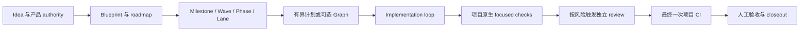

# SAGE-Kit

[English](README.md) | [中文](README.zh-CN.md)

[](https://github.com/JoeKeepGo/SAGE-Kit/actions/workflows/sagekit-self-check.yml)
[](https://github.com/JoeKeepGo/SAGE-Kit/releases)
[](LICENSE)

SAGE-Kit 是面向长期 Agent 协作产品开发的模型原生 SPEC 与 Harness 框架。它区分
产品权威、执行、证据、审查与验收，但不再在模型和项目之间增加另一套运行时。

SAGE-Kit 没有 CLI、package runtime、daemon、scheduler 或隐藏 validator。模型读取
项目当前 authority 与 SPEC，直接使用项目原生工具，并由项目 CI 验证最终候选。

## 核心流程


```mermaid
flowchart LR
  A["Idea 与产品 authority"] --> B["Blueprint 与 roadmap"]
  B --> C["Milestone / Wave / Phase / Lane"]
  C --> D["有界计划或可选 Graph"]
  D --> E["Implementation loop"]
  E --> F["项目原生 focused checks"]
  F --> G["按风险触发独立 review"]
  G --> H["最终一次项目 CI"]
  H --> I["人工验收与 closeout"]
```

Loop 负责推进工作；Graph 只在依赖、join、gate 或并行关系能改善决策时启用。
Light 工作不强制使用 Graph。

## 快速接入

1. 通过宿主的 Skill 机制引用或安装 [`skills/sage-kit`](skills/sage-kit)。
2. 使用项目自有的紧凑 `ACTIVE_CONTEXT` 保存当前事实和 handoff。
3. 向模型提供 active SPEC、允许路径、验收条件和审批边界。
4. 根据真实风险选择 Light、Standard 或 Heavy。
5. 实现期间只运行项目 focused checks，最终候选只运行一次项目 CI。

建议从 [`SAGE_CORE.md`](docs/SAGE_CORE.md)、
[`AGENT_HARNESS.md`](docs/agent/AGENT_HARNESS.md) 和
[`templates`](docs/templates) 开始。

## 治理等级

| 等级 | 适用工作 | 常见结构 |
|---|---|---|
| Light | 小型、低风险、边界明确的修改 | 单一模型 loop、focused check、简洁证据 |
| Standard | 普通多文件产品工作 | 有界计划、受影响面 review、项目 CI |
| Heavy | 委派、安全、权限、发布或广泛集成风险 | 显式 lanes/Graph、独立 review、具名人工 gates |

治理等级与权限彼此独立。Heavy controller 不会自动获得写入、corrective、submit
或 acceptance authority。

## 权威边界

- 项目拥有产品需求、threat model、范围、权限、gates、tests 与 acceptance。
- `ACTIVE_CONTEXT` 保存当前 handoff 真值；历史文档只有被当前 authority 明确选择时
  才能作为执行依据。
- [`contracts`](contracts) 提供可选、静态、语言无关的 Graph、Node Result、Task 与
  Evidence schema。合同存在不会执行任务或授予权限。
- [`docs`](docs) 保存治理模型与规划模板。
- [`skills/sage-kit`](skills/sage-kit) 为各宿主激活并路由模型原生工作流。

## 支持的宿主

Skill 包含 Codex、Claude Code、OpenCode 和 Kimi 指导，并可与 specialist Skills、
plugins、MCP、原生 subagents 及项目自动化共存。所有能力仍受项目 authority 约束，
不得静默扩张范围。

跨 Milestone 无人值守执行只在人工预授权了 milestone 范围、允许操作、停止条件和
人工专属决策时成立。产品、权限、安全、破坏性操作、凭据和验收始终属于人工 gate。

## 验证经济性

```text
每次修改        -> 项目原生 focused check
受影响边界      -> affected-only review 或 verification
输入未变化      -> 复用可归因 evidence
最终候选        -> 一次项目 CI
finding 已修复  -> targeted re-review，不重放 full review
```

当 finding 持续收敛且范围不扩张时可以自动继续；同一根因连续两个获批轮次无进展才
停止。所有权明确的普通 wording、EOF 和非语义一致性问题直接修正。

## 仓库结构

```text
contracts/          可选机器可读静态合同
docs/               唯一治理文档、profiles 与 templates
skills/sage-kit/    模型激活与宿主路由
scripts/            轻量仓库完整性检查
tests/              已发布宿主 hooks 的 Shell/PowerShell 测试
```

Release 使用 GitHub source archive，并可附带静态 Skill bundle；不会发布可执行的
SAGE-Kit runtime。参见 [`RELEASE.md`](docs/RELEASE.md) 与
[`模型原生迁移指南`](docs/MIGRATION_MODEL_NATIVE.md)。

## 适用场景

SAGE-Kit 适合跨 Session、Milestone、人员或 Agent 的长期工作，以及必须审计
authority、evidence 与 completion 的项目。短脚本和一次性原型通常不需要这套结构。
