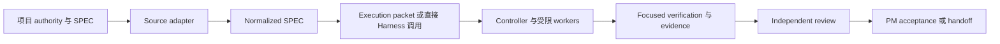

# SAGE-Kit

[English](README.md) | [中文](README.zh-CN.md)

[](https://github.com/JoeKeepGo/SAGE-Kit/actions/workflows/sagekit-self-check.yml)
[](https://github.com/JoeKeepGo/SAGE-Kit/releases)
[](https://www.python.org/)
[](LICENSE)

SAGE-Kit 是面向长期、Agent 辅助软件工程的项目治理与证据运行时。

它由项目自有 SPEC 合同、可嵌入的 Python Harness、冻结验证合同、资源感知执行
以及可选的多运行时 Skill 组成。产品需求、范围、权限、审批门和验收始终由项目
决定；SAGE-Kit 提供执行和验证这些决定的机制，不会把框架默认值变成产品策略。

项目自有的 SPEC 与配置是权威来源。Harness 解释并执行这些边界，但不拥有项目
策略。

## 核心模型

- 项目自有 SPEC 与配置定义真实工作。
- Source adapter 统一规范化 Markdown 或机器可读输入，文件位置不进入执行身份。
- 可嵌入 Harness 负责编译 packet、验证合同、管理受限执行并返回结构化 evidence。
- 紧凑 active context 保存当前 handoff 事实；accepted history 保持不可变参考。
- 实现、审查、纠正、验证与验收使用彼此独立的权限边界。
- 框架规范资源随 package 发布，唯一来源位于
  [`sagekit/resources`](sagekit/resources)。

## 架构


```mermaid
flowchart LR
  A["项目 authority 与 SPEC"] --> B["Source adapter"]
  B --> C["Normalized SPEC"]
  C --> D["Execution packet 或直接 Harness 调用"]
  D --> E["Controller 与受限 workers"]
  E --> F["Focused verification 与 evidence"]
  F --> G["Independent review"]
  G --> H["PM acceptance 或 handoff"]
```

路径只提供 provenance。执行身份绑定项目 authority、合同、规范化输入、workspace
状态和 candidate evidence，不再依赖唯一固定的 `docs/<milestone>` 目录。

## 安装

从 GitHub 安装当前正式版本：

```bash
python -m pip install \
  "git+https://github.com/JoeKeepGo/SAGE-Kit.git@v2026.7.28.2"
```

本地开发：

```bash
git clone https://github.com/JoeKeepGo/SAGE-Kit.git
cd SAGE-Kit
python -m pip install -e .
```

package 没有第三方运行时依赖。

## 最小 Harness 示例

公共 API 由 `sagekit` 直接导出：

```python
from pathlib import Path

from sagekit import check_project

result = check_project(Path("."))
for finding in result.findings:
    print(finding.to_text())

if not result.ok:
    raise SystemExit(1)
```

项目工具还可以通过公共 API：

- 加载并规范化配置的 SPEC source；
- 编译临时 execution packet；
- 发现和验证 workspace binding；
- 冻结、复算 candidate fingerprint；
- 创建和恢复 checkpoint；
- 验证版本化 Task/Evidence records；
- 执行受资源治理的命令和 Git 操作。

这些 API 提供执行、证据和约束机制。API 返回值不会授予 PM acceptance，也不会
重新定义项目完成条件。

## 项目绑定

新项目建议使用：

- `SAGEKIT_CONFIG.json`：绑定 package、SPEC source、active context 和
  active-only/legacy scope；
- `SAGE_PROJECT.json`：使用 Thin documents 时固定合同；其机器合同 ID 是
  `thin-v1`；
- 项目自有 milestone/phase manifests，或显式 Markdown source adapter；
- 可配置的紧凑 `ACTIVE_CONTEXT`：只保存当前 handoff 事实。

支持的 adoption profile：

- `package-bound`：使用已安装 package 的合同和资源；
- `vendored-legacy`：保留明确授权的传统 framework 布局。

支持的 execution scope：

- `active-only`：只检查当前 authority，不追溯扫描 accepted history；
- `legacy-all`：保留明确选择的旧版行为。

显式 source mapping 会 fail closed。SAGE-Kit 不会静默回退到其他 authority 来源。

## 可选传统布局

项目明确选择 `legacy-markdown` 时仍可使用传统 Markdown 布局。它是兼容输入，
不是第二份 framework 副本，也不是 package-bound 新项目的默认方式。

## Controller 工作流

一个正常 Milestone 使用三个逻辑 Controller：

1. **PM Controller**：确定 milestone、DAG、范围、验收条件、资源策略和审批边界。
2. **Coder Controller**：派发受限实现和 focused tests，汇总 evidence 并冻结
   candidate。
3. **Final Review Controller**：执行独立 review lanes，路由已授权纠正，把 verdict
   返回 PM。

Subagent 继承调用方的 allowed、read-only 和 forbidden 边界，不获得产品决策权；
除非明确授权，也不能继续派发可执行 descendants。

## 验证经济性

SAGE-Kit 使用 affected-evidence 模型：

```text
worker change        -> focused verification
lane closure         -> affected-lane verification
frozen candidate     -> 一次串行 final verification graph
unchanged inputs     -> 复用已绑定 evidence
```

`WAIVED`、`SKIPPED`、`HOST_UNAVAILABLE` 和未完成验证都不能记为 `PASS`。超时或
资源耗尽应返回真实 handoff，而不是伪造工程失败或成功。

## 兼容性

SAGE-Kit 保留：

- Thin documents 和明确选择的 `legacy-markdown` documents；
- 冻结 validation contracts 与版本兼容；
- 既有 `SAGE_PROJECT.json` 项目；
- 可配置的传统 `docs/...` consumer 布局；
- accepted history 的不可变 provenance。

Consumer 项目仍可使用 `docs/...`。SAGE-Kit 源码仓库不再把 package resources
复制为第二套顶层 `docs` 镜像。

## 可选 Skill

公共 Skill 位于 [`skills/sage-kit`](skills/sage-kit)。Installed Skill 为 Codex、
Claude Code、OpenCode、Kimi Work 和兼容运行时提供 activation、routing、
authority、delegation、review 与 completion 指导。

Skill 是可选入口，不是项目 authority，不能自行创建缺失的产品需求、threat model、
migration、Gate 或验收条件。

## 仓库结构

```text
sagekit/                    可嵌入 Harness 与运行时模块
sagekit/resources/docs/     唯一规范治理文档与模板
sagekit/resources/contracts 冻结机器可读合同
skills/sage-kit/            可选多运行时 Assistant Skill
scripts/                    串行测试与 package helpers
tests/                      Unit、integration、compatibility 与 smoke tests
```

建议从以下文件开始：

- [`SAGE_CORE.md`](sagekit/resources/docs/SAGE_CORE.md)
- [`AGENT_HARNESS.md`](sagekit/resources/docs/agent/AGENT_HARNESS.md)
- [`EXECUTION_ECONOMY.md`](sagekit/resources/docs/agent/EXECUTION_ECONOMY.md)
- [`SPEC_SOURCE_CONTRACT.md`](sagekit/resources/docs/agent/SPEC_SOURCE_CONTRACT.md)

## 参与开发

先运行与改动范围直接相关的 focused checks：

```bash
python -B -m scripts.run_tests focused --repository .
```

当改动涉及更广范围时，可通过 `scripts.run_tests` 选择 unit、integration、
source-repository 或 package lane。

## 适用场景

SAGE-Kit 适合：

- 工作跨越多个 Session、Milestone、人员或 Agent；
- 必须区分 authority、scope、evidence 和 completion；
- 验证成本较高，需要 evidence reuse 和资源协调；
- accepted history 必须可审计，但不能成为当前 authority。

对于短脚本或一次性原型，这套治理通常会显得过重。
